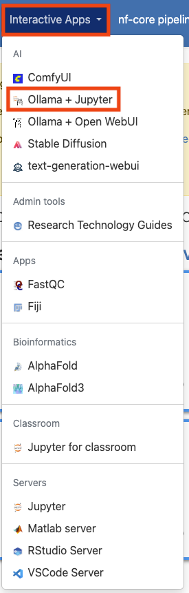
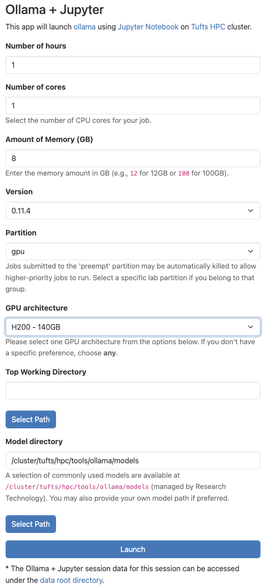
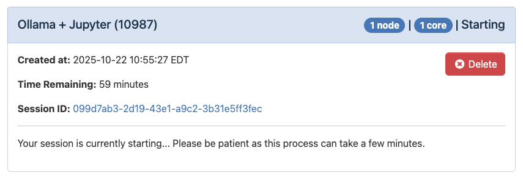
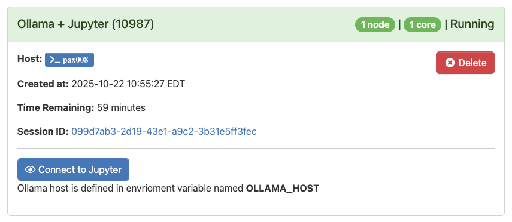

# Using LLM Notebooks on the Cluster

By Peter Nadel, Digital Humanities Natural Language Processing Specialist, and Ryan Veiga, Data Science Specialist

LLM Notebooks combine open-source LLMs with a Jupyter-based Python environment, enabling users to build intelligent workflows, prototype AI-driven agents, and integrate generative models into data analysis and course work. The experience is meant to expose open-source LLMs within the popular Jupyter interface. This provides a similar experience to accessing cloud-based API models (such as OpenAI or Anthropic APIs), while ensuring privacy by keeping all the data (user input, system prompts, responses) local. (For more information on the secure use of generative AI tools at Tufts, please consult the Tufts Technology Services [Guidelines for Use of Generative AI Tools.](https://it.tufts.edu/guidelines-use-generative-ai-tools))

In this document, we show the best practices for accessing LLM Notebooks on the Tufts High Performance Compute (HPC) Cluster. This document does not provide an in-depth description of its features, however. For more information on what the LLM Notebooks application is and what you can do with it, see the links under "What is the LLM Notebooks Application?" below. Additionally, we have curated and documented the most useful open source models, stored securely on the Tufts HPC storage. The documentation of the models are available [here](https://tufts.box.com/v/ResearchChatbotModels).

The LLM Notebooks application is intended for researchers and educators who want flexibility and control through a code-first approach. This tool is not meant for personal use.

## Who is this for?

This application is best suited for individuals with experience with the Python programming language and who would like to learn more about how AI can facilitate certain research applications. This tools can support high-throughput methods, but users may find other approaches easier when scaling to larger and larger datasets.

## What is the LLM Notebooks Application?

The LLM Notebooks application is our implementation of Ollama with Jupyter Notebooks on the Tufts High Performance Computing (HPC) Cluster.

- **Ollama** is a program for using large language models (LLMs). Specifically, Ollama focuses open source and open weight LLMs usually accessible on websites like [HuggingFace](https://huggingface.co/). We take advantage of the compute resources on our Cluster to run Ollama with a variety of pre-downloaded models. Ollama is the bridge that we use to send your questions/requests/responses from your keyboard to the LLM itself.
- **Jupyter** is a web-based Python programming platform that enables interactive computing through computational notebooks. A notebook is a shareable document that combines computer code, natural language documentation, interactive visualizations and data. Jupyter notebooks are designed for fast prototyping and code explanation. It is an ideal choice for classroom learning, as well as research software development.

For a more in-depth description of all the features of Ollama and Jupyter Notebooks, we encourage you to explore the documentation of each of these projects:

- [Ollama documentation](https://docs.ollama.com/)
- [Jupyter documentation](https://jupyter.org/).

We also encourage you to explore the [HPC Cluster documentation](https://rtguides.it.tufts.edu/hpc/index.html).

## Getting started

LLM Notebooks is an Open OnDemand application on the Cluster, meaning that it can be accessed from the Interactive Apps drop-down menu in the Open OnDemand website. To get started, visit and log into the [Open OnDemand website for the Tufts Cluster](https://ondemand-prod.pax.tufts.edu/). Once there, select the "Interactive Apps" drop-down menu and click on "LLM Notebooks".



## Configuring your session

Once you've clicked on "LLM Notebooks", you will be able to configure the settings for using the application. Some of these options can be confusing, so we have left an example configuration in the image below. If you are unsure, feel free to use the same values as in the example. Otherwise, we explore what these parameters mean here:

- _Number of hours_: This parameter controls how long your session will run for. At the conclusion of this time, your session will end. Be sure to choose a time that matches how you expect to need in hours. You can always budget more time than you may need and they end the session early if you need.
- _Number of cores_: This field controls how many CPU cores are allocated for your session. It is important to pick a value proportional to the size of the LLM you'd like to run. If you are having trouble choosing, you can use the value shown below.
- _Amount of Memory (GB)_: This setting controls how many gigabytes of RAM are allocated to your session. This value can also be difficult to choose, so I like to use double the amount of CPU cores that I have selected.
- _Partition_: For most Ollama application, you should choose the "gpu" option. Generally, we require hardware acceleration to run LLMs. You can run some models, however, with just CPUs, especially if you adjust the number of cores and amount of memory to be quite high, in which case, you could select "batch" for this option.
- _GPU architecture_: This parameter controls the type of GPU that is allocated for your session. For the most part, it may not matter, however, if you pick a GPU type that is high demand, it may take longer for your session to get allocated. For more information on how to check demand for GPUs, use the `hpctools` CLI. Learn more [here](https://rtguides.it.tufts.edu/hpc/examples/hpctools.html).

The rest of the the fields should remain in their default configuration. When you are ready, click "Launch".



## Logging in to Ollama

Once you've launched your session, you will see the loading message below. It is very normal to see this for a couple minutes.



When the application is ready, you'll see the message below:



When you are ready click "Connect to Jupyter". All of the data that you enter here **will stay on the Cluster and will not be shared on the internet.**

## Using LLM Notebooks

The user is expected to be familiar with the basics of Python and the Jupyter notebook environment. To access an Ollama LLM from within your Jupyter notebook, you will need to first import the chat function from the Ollama module:

```python
from ollama import chat
```

To use the chat function, you will need to specify a model and the messages to pass to that model, as shown in the following example:

```python
response = chat(
    model="gemma3:12b",
    messages=[
        {
            "role": "system",
            "content": (
                "You are a patient programming tutor. "
                "Explain things step by step, write code in small pieces, "
                "and add clear comments to every code block."
            ),
        },
        {
            "role": "user",
            "content": "Write a Python script to read a CSV and plot a histogram.",
        },
    ],
)


print(response["message"]["content"])
```

Note that we specified both the model (gemma3) and its size (12b, i.e. 12 billion parameters) separated by a colon. For a list of available models, [click here.](https://tufts.box.com/v/ResearchChatbotModels)

You should enter both a **system prompt** and **user prompt**. A system prompt gives instructions at the system level on how the LLM should respond to the user prompt, and will follow instructions of the system prompt in the event that it is in conflict with the user prompt. The system prompt is general used for framing the intended behavior of the chatbot, setting constraints and providing ethical guidance. The user prompt is the message that an end-user would enter to query the LLM, similar to entering a question into ChatGPT's user interface.

For an example of attaching external documents or data to your query using the Gemma 3 see the example below:

```python
from pypdf import PdfReader
import ollama

# Load PDF
reader = PdfReader("document.pdf")
text = "\n".join(page.extract_text() or "" for page in reader.pages)

# Send to Ollama in one message
response = ollama.chat(model="gemma3:27b", messages=[{"role": "user", "content": text}])

print(response["message"]["content"])
```

In this example, text is read from a PDF using the PdfReader function from the pypdf module, saved to an object called "text" in the Jupyter environment, and then passed to the model using "content" key value.

For additional questions, please reach out to TTS Research Technology at: tts-research@tufts.edu.
