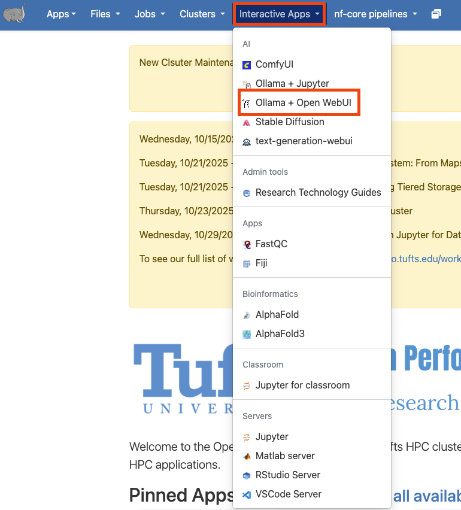
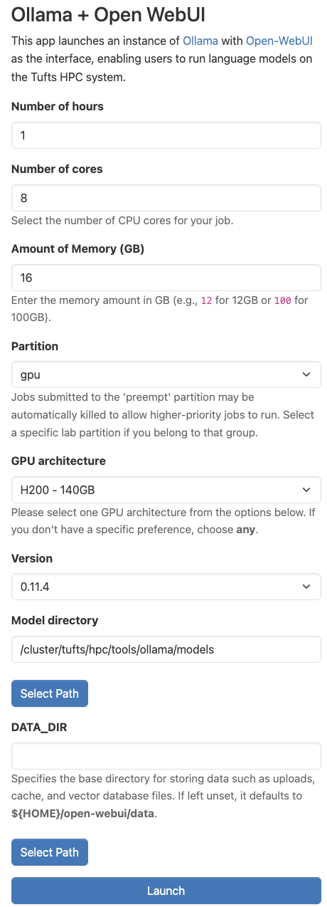

# Using the Research Chatbot (LLM) on the Cluster

By Peter Nadel, Digital Humanities Natural Language Processing Specialist, and Ryan Veiga, Data Science Specialist

The Research Chatbot provides a chat interface for using open-source large language models (LLMs), similar to ChatGPT, making it easy to explore generative AI models without coding. However, unlike ChatGPT and other web-based LLMs, the Research Chatbot runs locally on Tufts University servers, making any information shared with the ChatBot secure and private. (For more information on the secure use of generative AI tools at Tufts, please consult the Tufts Technology Services [Guidelines for Use of Generative AI Tools.](https://it.tufts.edu/guidelines-use-generative-ai-tools))

In this document, we show the best practices for accessing the Research Chatbot (LLM) on the Tufts High Performance Compute (HPC) Cluster. This document does not provide an in-depth description of its features, however. For more information on what the Research Chatbot is and what you can do with it, see the links under "What is the Research Chatbot?" below.

This tool is intended for educators or researchers who want to experiment with conversational models for classroom or research use. This tool not meant for personal use.

## Who is the Research Chatbot for?

The Research Chatbot is best suited for individuals who are **new** to working with AI for research and would like a secure, conversational experience that mimics web-based services like ChatGPT, Google Gemini, Microsoft Copilot, or Anthropic's Claude. This tool can give you a sense of how to use AI for research, but may not be suited for large data sets or complex or advanced requests. For more information on other options you have for AI on the Cluster, please visit [this link](TBD).

## What is the Research Chatbot?

The Research Chatbot is the Tufts University implementation of Ollama with Open WebUI on the High-Performance Computing (HPC) Cluster.

- **Ollama** is a program for using large language models (LLMs). Specifically, Ollama focuses open source and open weight LLMs usually accessible on websites like [HuggingFace](huggingface.co). We take advantage of the compute resources on our Cluster to run Ollama with a variety of pre-downloaded models. Ollama is the bridge that we use to send your questions/requests/responses from your keyboard to the LLM itself.

- Unlike Ollama, **Open WebUI** does not itself communicate with an LLM. Instead, it is the main interface for working with Ollama. It supports the wide variety of tasks that Ollama supports in a simple and clean user platform that facilitates experimentation and iteration. It has many different features that we cannot dive into in this document, but we encourage you to explore their documentation above, as well as the application itself.

For a more in-depth description of all the features of Ollama and Open WebUI, we encourage you to explore the documentation of each of these projects:

- [Ollama documentation](https://docs.ollama.com/)
- [Open WebUI documentation](https://docs.openwebui.com/).

We also encourage you to explore the [HPC Cluster documentation](https://rtguides.it.tufts.edu/hpc/index.html).

## Getting started

The Research Chatbot is an Open OnDemand application on the HPC Cluster, meaning that it can be accessed from the Interactive Apps drop-down menu in the Open OnDemand website. To get started, visit and log into the [Open OnDemand website for the Tufts Cluster](ondemand-p01.pax.tufts.edu). Once there, select the "Interactive Apps" drop-down menu and click on "Research Chatbot (LLMs)".

## Configuring your session

Once you've clicked on "Research Chatbot (LLMs)", you will be able to configure the settings for using the application. Some of these options can be confusing, so we have left an example configuration in the image below. If you are unsure, feel free to use the same values as in the example. Otherwise, we explore what these parameters mean here:

- *Number of hours*: This parameter controls how long your session will run for. At the conclusion of this time, your session will end. Be sure to choose a time that matches how you expect to need in hours. You can always budget more time than you may need and they end the session early if you need.
- *Number of cores*: This field controls how many CPU cores are allocated for your session. It is important to pick a value proportional to the size of the LLM you'd like to run. If you are having trouble choosing, you can use the value shown below.
- *Amount of Memory (GB)*: This setting controls how many gigabytes of RAM are allocated to your session. This value can also be difficult to choose; as a starting point, a loose "rule of thumb" is to double the number of CPU cores you have selected.
- *Partition*: For most Research Chatbot applications, you should choose the "gpu" option. Generally, we require hardware acceleration to run LLMs. You can run some models, however, with just CPUs, especially if you adjust the number of cores and amount of memory to be quite high, in which case, you could select "batch" for this option.
- *GPU architecture*: This parameter controls the type of GPU that is allocated for your session. For the most part, it may not matter, however, if you pick a GPU type that is high demand, it may take longer for your session to get allocated. For more information on how to check demand for GPUs, use the `hpctools` CLI. Learn more [here](https://rtguides.it.tufts.edu/hpc/examples/hpctools.html).
  The rest of the the fields should remain in their default configuration. When you are ready, click "Launch".

## Logging in to Ollama

Once you've launched your session, you will see the loading message below. It is very normal to see this for a couple minutes.

When the application is ready, you'll see the message below:

When you are ready, click "Connect to Ollama", which will open a browser window with a prompt to enter your login credentials. Note that if you are a first-time user, you will need to create an account. All of the data that you enter here **will stay on the Cluster and will not be shared on the internet.** You will then be able to use these login credentials to log in every time you want to use this application.

*Note*: First-time users must follow the directions in the blue box.

## Start using Ollama

After you have logged in you will be able to start chatting with a model. If you'd like to change this model you can select other option in the upper left corner.

For a list of all models and research use cases can be found [here](<>). For a list of features, please visit this page: https://docs.openwebui.com/features/. For other questions, please reach out to Research Technology at: tts-research@tufts.edu.
