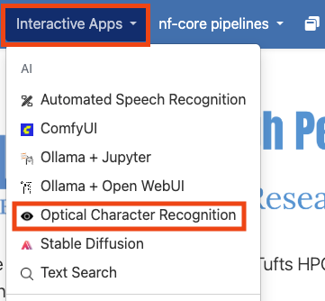
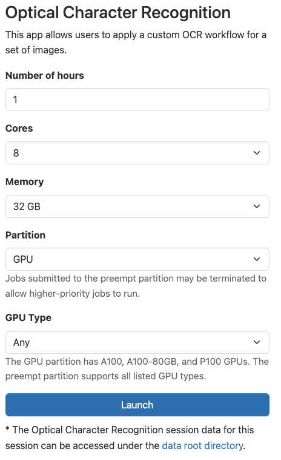
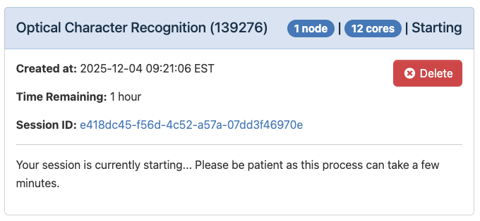
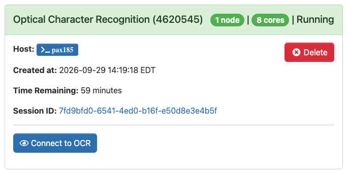
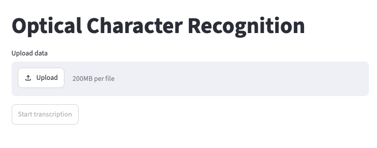
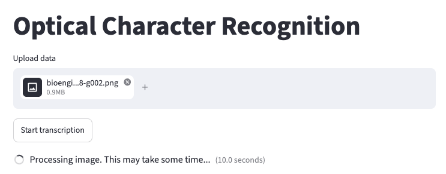
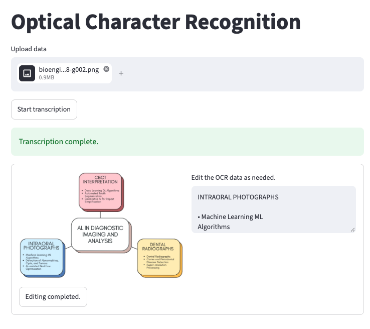

# Using Opitical Character Recognition on the Cluster

By Peter Nadel, Digital Humanities Natural Language Processing Specialist

In this document, we introduce and explain the use of the Optical Character Recognition (OCR) application on the Tufts High Performance Compute (HPC) Cluster. This document does not give an in-depth description of all of the intricacies of this application.

We also encourage you to explore the [HPC Cluster documentation](https://rtguides.it.tufts.edu/hpc/index.html).

## What is OCR?

The OCR application is designed to take image files and return a transcription of the text in that image and do so in a safe and secure fashion.

## Who is this for?

This application is best suited for individuals who require plain text of primary source documents for their research. Often time a key next step is searching through your data for key words. If you are interested in this feature, check out the Text Search application.

## OCR details

This application expects a folder of image files uploaded to the Cluster. So long as you have that you are able to use this application. If you only have one file, simply uploaded it in a folder by itself. You have the choice to output the results as either .txt files of the plain text or as PDFs that have highlightable text in them.

## Getting started

OCR is an Open OnDemand application on the Cluster, meaning that it can be access from the Interactive Apps drop down in the Open OnDemand website. To get started, visit and log into the [Open OnDemand website for the Tufts Cluster](https://ondemand-prod.pax.tufts.edu/). Once there, select the "Interactive Apps" drop down and click on "Optical Character Recognition".

## Configuring you session

Once you've clicked on "Optical Character Recognition", you will be able to configure the setting for using the application. Some of these options can be confusing, so we have left an example configuration below. If you are unsure, feel free to use this one. Otherwise, we explore what these parameters mean here:

- _Number of hours_: This parameter controls how long your session will run for. At the conclusion of this time, your session will end. Be sure to choose a time that matches how you expect to need in hours. You can always budget more time than you may need and they end the session early if you need.
- _Number of cores_: This field controls how many CPU cores are allocated for your session. It is important to pick a value proportional to the size of the LLM you'd like to run. If you are having trouble choosing, you can use the value shown below.
- _Amount of Memory (GB)_: This setting controls how many gigabytes of RAM are allocated to your session. This value can also be difficult to choose, so I like to use double the amount of CPU cores that I have selected.
- _Partition_: You should choose the "gpu" option. Generally, we require hardware acceleration to run OCR models. You can run some models, however, with just CPUs, especially if you adjust the number of cores and amount of memory to be quite high, in which case, you could select "batch" for this option.
- _GPU Type_: This parameter controls which kind of GPU to use for OCR. For these applications, we recommend that you choose "A100-40G" or "A100-80G".

The rest of the the fields should remain in their default configuration. When you are ready, click "Launch".

## Getting your results

Once you've launched your session, you will see the loading message below. It is very normal to see this for a couple minutes.

When the application starts running, you'll see the message below:

Click on "Connect to OCR" to proceed. After some time (around a minute or two), the application should finish loading. You can start uploading your images whenever you are ready.

While the OCR is processing, you should see a something similar to the image below:

When the application is complete, you will have the opportunity to make any edits you need to the output.

When you are done, you can click on "Editing completed." Then you can download the output.

For any questions, please reach out to Research Technology at: tts-research@tufts.edu.
