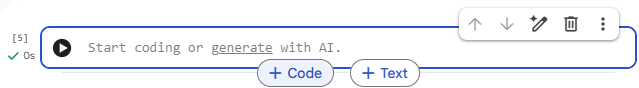
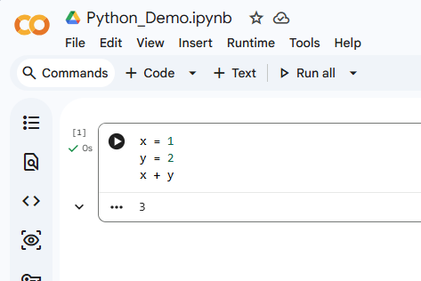
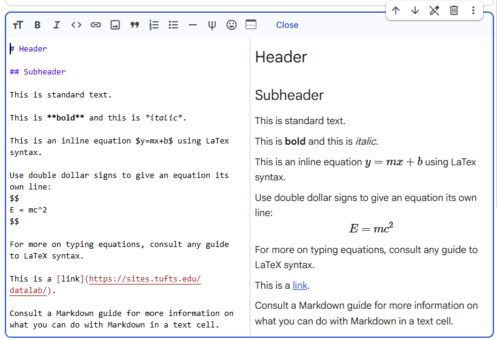

# Google Colab

This page assumes you have decided to use Google Colab for Python programming and are looking for instructions on how to get started. If you would like to review the strengths and limitations of Google Colab, or if you remain unsure that Google Colab is the best setup for you, please consult the documentation under [Which Python Setup is Right for You?](10_which_python_setup.md).

As a reminder, Google Colab is integrated with Google Drive and relies on Google Drive for storage of both code and data files. In many cases, this is not an approved storage for sensitive or IRB-protected data. If your data falls into this category, you should instead follow the instructions for [installing Python on your local computer](30_vs_code_with_miniforge.md) or consider applying for an account with the [Tufts High-Performance Computing (HPC) cluster](https://it.tufts.edu/high-performance-computing). For more information on where to store sensitive data, consult the Tufts [Data Storage Finder](https://access.tufts.edu/data-finder).  For further questions, or to request an advanced consultation, contact Research Technology at tts-research@elist.tufts.edu. 

> If you are a **complete beginner**: many Python tutorials and online courses use Jupyter Notebooks to teach Python. Because Google Colab is built on top of Jupyter Notebooks, you can go ahead and create a Google Colab account and then use Google Colab for any of these tutorials. While in many ways Google Colab works the same way as the more standard Jupyter Notebook web app recommended by many of these tutorials, we find that it has some additional features and refinements that make it both easier to use for beginners and more powerful for your research projects, so that you can continue using it for more projects for longer until you're ready for a more advanced installation. Alternatively, if you prefer, you can follow along with whatever your tutorial or course recommends, and then return to this page when you're ready to move on to your first research projects. Students should note that the instructions here are not meant to replace the guidance of your instructor or professor. 
>
> For some helpful links to learning resources after you've set up your Google Colab account, see the "further resources" section here. 

## Accessing Google Colab

To access Google Colab, open a web browser (e.g. Edge, Chrome, Safari, Firefox, etc.) and navigate to https://colab.research.google.com/. In the top-right corner, click "Sign in". You can use any Google account to access Google Colab. Tufts students, staff, and faculty also have the option of using their Tufts email to log in, in which case a new account will be created for you and the login credentials will be managed by Tufts. Entering your Tufts email will redirect you to the Tufts SSO (Single Sign On), where you can use your standard Tufts credentials. 

Google Colab is free for all users and automatically comes with 15 GB of storage. There is also a premium tier which allows access to more powerful computing resources and places fewer restrictions on usage. Students and educators can use their Tufts email addresses to access Colab Pro free of charge. For more information, see the following link:

https://colab.research.google.com/signup

## Getting Started in Google Colab

Google Colab uses Jupyter Notebook files (with extension .ipynb) for Python coding. When you first log in to Google Colab, you will be directed to a welcome page with some general information about using Jupyter Notebook in Google Colab. This page will likely be confusing for beginners, so we have also compiled a quick-start guide below. This will give you just enough information to get started, but you may wish to consult the Jupyter Notebook documentation or a beginner-level Jupyter Notebook tutorial for a more complete introduction to using Jupyter notebooks effectively. Those who are already familiar with Jupyter Notebook may still find the guide below useful as it touches on topics specific to using it with Google Colab, such as accessing your data files in Google Drive. 

### Creating a New Jupyter Notebook

To create a new Jupyter notebook document, go to the File menu and select "New Notebook in Drive". A new blank notebook will be created for you with the title Untitled0.ipynb. You can click on the title in the top left corner to give it a new name.

This notebook is automatically saved in your Google Drive in a folder called "Colab Notebooks". To move it to a new location, you can either go to the File menu and select "Move", or, in a new browser window, open your Google Drive at https://drive.google.com/ and use the file management tools in the Google Drive web interface.


### Cells

Jupyter Notebook files are places to write both text (topic headings, explanatory notes, research documentation, etc) and code in a single document. 

The basic building block of a Jupyter Notebook is a cell. You will need to create cells in your notebook in order to add code or text to your document.
- Code Cells are places to write code in Python.
- Markdown (Text) Cells are places to write text using Markdown syntax. They also support LaTeX syntax for writing equations. 

When you create a new notebook, Google Colab automatically creates your first code cell for you. To create additional cells, you can hover your cursor near the top or bottom of your cell and buttons will appear for adding a new code or text cell above or below the current cell; see the buttons labeled "+Code" and "+Text" in the image below.



When you select a cell, a menu will appear in the top right corner of the cell with additional options to move the cell (the up/down arrows), delete the cell (the trash can icon), or access AI tools (the pen icon with the gemini logo).

Experienced programmers will often prefer to use keyboard shortcuts to code more quickly. Google Colab is compatible with standard Jupyter Notebook keyboard shortcuts. For more information, consult any Jupyter Notebook tutorial or reference guide. 


#### Code Cells

Once you have created a code cell, you can click the cell once to select it (if not already selected) and then click a second time to enter *edit* mode. In edit mode, you can place your cursor inside the cell and start typing your code. You then have three options to run your code:

1. Click on the "run" button in the top-left corner of the cell (the black circle with the right-pointing white triangle in the image below).
2. Press ctrl+enter (or cmd+enter on MacOS) to run the selected cell while keeping the cell selected.
3. Press shift+enter to run the selected cell and move to the next code cell. If you have not created any code cells after the selected cell, a new one will automatically be created. 

When you run your code with any of the three options above, the output of your code will appear at the bottom of the cell, as shown in the image below. Feel free to test it out by typing out the code shown in the image below. If you run it correctly, you will see the answer (3) appear in the space at the bottom of the cell. This is where Google Colab shows you the output of your code. 



Note that if you have multiple lines of code with output, it may not show all of them in the output area at the bottom of the cell. You can force the output to show by wrapping the command in the print function, e.g. `print(x + y)`. 

Don't be shy about creating many code cells. If you try to put too much code in a single cell, you will end up rerunning large sections of previous code that aren't relevant to the part you're working on, and this can slow you down. For example, if you load your data in one cell, you should create a new cell to do data exploration and summary statistics; that way you don't have to reload your data every time you add a new summary statistic and want to rerun the cell. Continuing with this example, you may also want to break up your data exploration into multiple cells—different cells for different tasks, such as a histogram for a variable of interest in one cell, and a table of column means in another. 

Code cells are a great way to organize your code into distinct subtasks, each with their own separate output. 

#### Markdown (Text) Cells

Markdown cells, or "text cells", are places for anything from explanatory notes to full-fledged report writing. 

When you create a new Markdown cell, you will automatically enter "edit" mode, which allows you to type your text in Markdown syntax. (If you leave a cell, you can always return to edit mode by double-clicking the cell, or by selecting the cell and pressing "enter".) When you type in edit mode, a preview of your fully rendered text will automatically appear in the right half of the Markdown cell. 



Note that Markdown has its own special syntax for creating things like topic headings and subheadings, italicizing or bolding words, adding links, etc. For more information on how to use Markdown syntax, see this online [Markdown guide](https://www.markdownguide.org/basic-syntax/). 

Markdown cells also allow you to use LaTeX to type equations. LaTeX expressions should be enclosed in single dollar signs (for inline equations) or double dollar signs (for equations on their own line.) 

### Saving Your Scripts

To save your Jupyter Notebook file, select "Save" from the file menu. 

### Loading Data Files


Google Colab manages files and documents through its integration with Google Drive. If you do not have a Google Drive account, or do not wish to use a personal or lab account with Google Colab, you can use your Tufts single sign on (SSO) to log into Google Drive and manage your files. 

If you have determined that your data can be stored in Google Drive, continue below, otherwise consult the Tufts [Data Storage Finder](https://access.tufts.edu/data-finder).

#### Mounting Your Google Drive in Colab

In order to access your files in Google Drive, you will first need to mount the drive. In a new code cell, enter the following code:

```
from google.colab import drive
drive.mount('/content/drive')
```

When you run the cell (ctrl+enter for Windows or cmd+enter for MacOS), a pop-up window will appear asking for permission for Google Colab to access your Google Drive. (You can either grant all permissions or pick which permissions to give. Note that we have not tested Google Colab with partial permissions and cannot advise which are essential and which can be omitted.)

If the drive has been successfully mounted, you will see the following message in your cell output:

```
Mounted at /content/drive
```

You can also view the files in your mounted drive by clicking the file icon in the toolbar on the left side of your screen. To see your Google Drive files, select "drive" and then "MyDrive". 


#### Loading Data from Your Mounted Google Drive

In Python, in order to open and work with data files, you first need the pandas library. In Google Colab, pandas comes pre-installed, so there is no need to install it with pip or conda. For more information on using libraries in Google Colab, see [Libraries and Packages](#libraries-and-packages) 

It is good practice to dedicate a code cell near the top of your notebook to importing any libraries you will need for your project. In this code cell, type the following:

```
import pandas as pd
```

Running this cell will now import the pandas library into your notebook and give it the alias "pd" to use whenever you want to access that library. 

Let's now imagine that you created a folder called "SampleProject" in your Google Drive, and that inside that folder you have a data file called "sample_research_data_file.csv". In a new code cell, enter:

```
mydata = pd.read_csv("/content/drive/MyDrive/SampleProject/sample_research_data_file.csv")
```

This will create a pandas data frame called "mydata" with the contents of sample_research_data_file.csv. As long as your files are in Google Drive, the first three parts of the file path above will match the above example ('/content/drive/MyDrive/'). Beyond that point, you should replace the file path above with your own Google Drive folder structure.

If you do not remember the exact file path for your data, you can easily retrieve it from the files tab of the toolbar on the left side of your screen. Locate the file in drive > MyDrive and hover your mouse over the file name to see a menu button for that file. Click to open the menu and select "Copy File Path". This will give you a file path you can copy directly into the `pd.read_csv()` function.

For a reference guide to working with pandas, see the [official documentation](https://pandas.pydata.org/docs/getting_started/index.html) or consult any introductory textbook on data analysis with Python. 


### Libraries and Packages

In Python, a **library** is a bundle of ready-made code intended to provide additional functionality that doesn't come with standard Python. Libraries are written by members of the broader Python community and are made available to users through centralized repositories for easy installation and use. 

It is nearly impossible to do data science, research, or data analysis in Python without importing libraries to use in your code. For example, most projects will include the *pandas* library, which facilitates loading and working with data sets, and/or *NumPy*, which enables many mathematical operations. 

The good news is, in Colab, many of the libraries that you will need already come pre-installed. You can verify this for yourself by importing the pandas library in a code block.

```
import pandas as pd
```
It should run without error. 

#### What if the library/package I need is missing?

If the library you need is not included in Google Colab by default, see the instructions for downloading and installing your library here:

https://colab.research.google.com/notebooks/snippets/importing_libraries.ipynb


