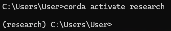
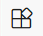
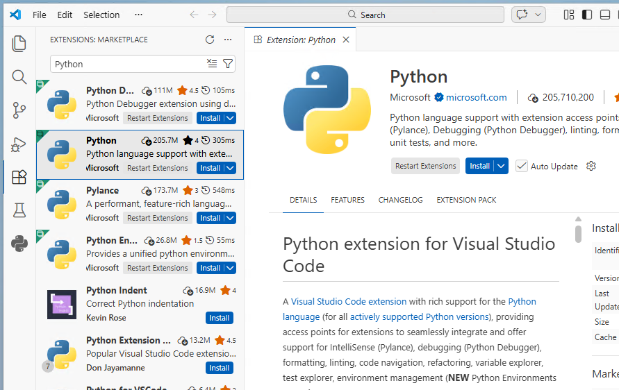
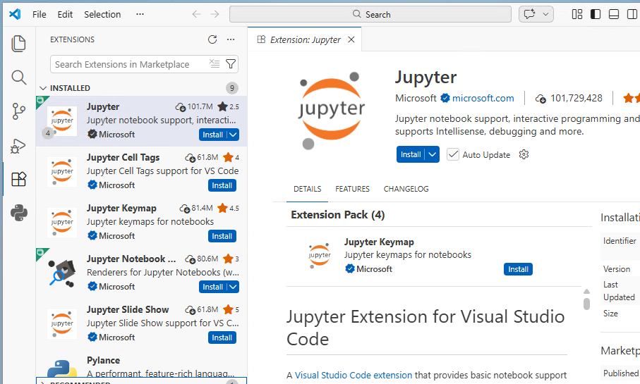
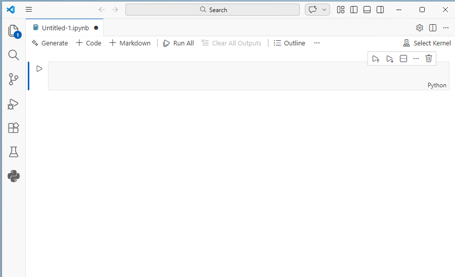
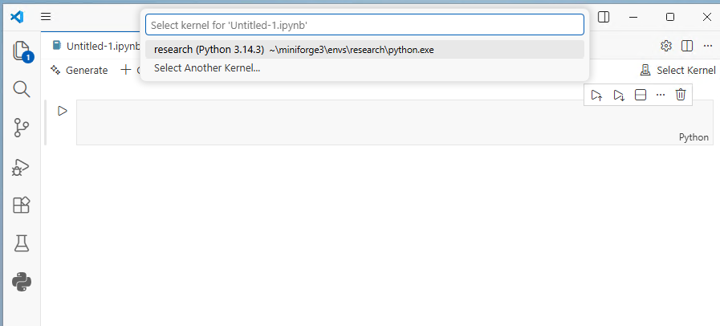

# Installing and Setting Up Python with Microsoft Visual Studio Code and Conda (Miniforge)

This guide is for those who have decided to use Microsoft Visual Studio (VS) Code with conda (using the Miniforge distribution) for Python programming and are looking for instructions on how to get started. If you would like to review the strengths and limitations of this setup, or if you remain unsure that this is the best setup for you, please consult the documentation under [Which Python Setup is Right for You?](10-which-python-setup.md)

This page will walk you through the installation and configuration process, up to the point of creating your first Jupyter Notebook file. Once you have completed these steps, we highly recommend continuing on to our [VS Code and Conda: Getting the Most Out of Your Setup](40-vs-code-and-conda-users-guide.md) guide, in order to ensure that you are getting the most out of your setup and using all its features effectively.

## Overview

This Python setup comes in two parts:

- **Miniforge** is a distribution of **conda**, which is an open-source tool for managing Python environments and libraries (sometimes called "packages").

- **Microsoft Visual Studio Code** (or "VS Code" for short) is an Interactive Development Environment (IDE), or an application that provides a graphical user interface for writing your code and viewing its output.

To use this setup effectively, you will need to learn how to use conda tools to create environments and install libraries. If you are unfamiliar with the concepts behind Python environments, libraries, and the role of an environment/package manager, we recommend returning to our [explanation](10-which-python-setup.md#what-are-environments-and-libraries) on our "Which Python Setup is Right for Me?" page.

## Installation and Setup Instructions

### Step 1: Install Conda via the Miniforge Distribution

> Note: if you have a prior installation of Anaconda or Miniconda on your machine, you will want to uninstall it before installing miniforge. For more information on uninstalling Anaconda or Miniconda, click [here](https://www.anaconda.com/docs/getting-started/anaconda/uninstall).

The installer for miniforge can be obtained from the official conda-forge website:

https://conda-forge.org/download/

#### Windows

Under "Miniforge Latest Release", download the installer that corresponds to your operating system. Double-click the installer in your Downloads folder to launch the installation process, accepting all defaults.

#### MacOS

Under "Miniforge Latest Release", download the installer that corresponds to the make of your processor. (If you are unsure of the make of your processor, click the apple icon in the top-left corner of your screen, and then select "About this Mac". In the pop-up window, the "Chip" field will list either an Apple or Intel chip.)

MacOS users should take note of the installation instructions at the bottom of the page where you downloaded the installer (linked above). To launch the installer, you will need to open a terminal, navigate to your download, and type the command given in those instructions.

- Search your system for "Terminal" to launch the Terminal application.
- Navigate to your Downloads folder from the Terminal command line. In most cases, you will be in your user directory by default, and because the Downloads folder is a subdirectory of your user directory, you can simply type `cd Downloads/` and press enter. (If this does not work, you will need to type `cd` followed by the full path to the folder where your Miniforge installer download is located.)
- Launch the installer with the command specified in the installation instructions on the page where you downloaded the Miniforge installer.
- Proceed with the installer, accepting all defaults and answering "yes" to all questions (including a question about automatic activation of conda in Terminal after the installation is complete).

### Step 2: Configure and Update Conda

After the Miniforge installation is complete, there are a few additional steps to configure the installation and ensure that conda is up to date.

#### Windows

To begin, search your system for "Miniforge Prompt" to locate and open the Miniforge Prompt application that was included in your miniforge installation. This is essentially a system terminal with conda already activated for your convenience. Then proceed to the Configuration Commands section below, using Miniforge Prompt to run the commands.

#### MacOS

The installation process for conda should have created a setting that automatically activates conda in any new terminal. To test this, open the Terminal application and look for the word "(base)" in parentheses preceding the command prompt. You can also type `conda --version` into the command prompt and press enter. If you see the word "conda" with a version number, then conda is activated. If not, see the [Conda is not working from the Terminal application](#conda-is-not-working-from-the-terminal-application) section of the troubleshooting guide at the end of this page.

When you have verified that conda works from your terminal, proceed to Configuration Commands section below.

#### Configuration Commands

Paste each of the following commands into the command line and press enter:

- `conda init --all` (Mostly for Windows Users; rarely applicable to Mac OS)
  - This enables conda in any terminal, so you do not need to specifically open Miniforge Prompt every time you want to create environments or install libraries (may not work for all terminals in some system setups). This will also help VS Code detect your conda environments. You can test if this step was successful by opening a PowerShell or Command Prompt terminal and typing conda --version. If it returns the word "conda" with a version number, you will automatically be able to access conda from that terminal (without having to find and run the conda executable first). Note that if for some reason you have trouble accessing conda from your preferred terminal, you can still continue to use Miniforge Prompt to manage environments with conda.
- `conda update --yes --all`
  - This ensures conda is up to date.

The following additional steps are optional, but recommended:

- `conda config --set auto_activate false`
  - This prevents auto-activation of the default "base" environment when opening a conda-enabled terminal. Using base is discouraged because it does not provide a stable environment for your code and can cause problems for your setup. By deactivating auto-activation of the base environment, we reduce the risk that the user will make unadvised changes by accident. See the note in step 3 for a more detailed explanation of the base environment.
- `conda config --set channel_priority strict`
  - This command tells conda to use strict channel priority when installing libraries (packages). Conda can download packages from different “channels” (package sources), and sometimes the same package exists in more than one channel. With channel-priority strict, conda will always prefer packages from higher-priority channels (such as conda-forge, which Miniforge uses) and will not mix in lower-priority versions unless absolutely necessary. This helps prevent dependency conflicts and ensures your environments remain consistent and predictable.
- `conda install --yes --name base mamba`
  - This installs the "mamba" package installer. Using mamba (instead of conda) to install packages is optional, and some users prefer it for being faster than conda.

### Step 3: Create Your First Environment and Install Some Essential Libraries

> #### The Base Environment and Project Environments
>
> Before we proceed, it's important to note that conda comes with a special environment called the **base environment** by default. The base environment contains conda itself and the core tools needed to manage packages and environments. Unlike project-specific environments that you create for your own work, base is intended mainly for managing conda rather than for running your research or projects. Using the base environment for everyday work is discouraged. Installing packages into base can lead to dependency conflicts between projects, make your code harder to reproduce, and in some cases interfere with conda’s own functionality.
>
> Instead of using base, you will need to create new environments to use for your research projects. In this setup guide we will walk you through creating your first environment. For more advice on creating and managing environments, see our [Getting the Most Out of Your Setup](40-vs-code-and-conda-users-guide.md) guide.

Now let's create a new environment called "research" that you can use for a generic research project. (If you prefer to give it a different name, feel free to use that instead. Just be sure to substitute your preferred name wherever you see the word "research" in the instructions that follow. Conda environments should contain only letters, numbers, hyphens, underscores, or periods, but no spaces or other special characters.)

To create an environment, we need to open a terminal. On a Windows machine, you can click the search icon in your system tray and search "terminal". Mac users can open the search by pressing Command (⌘) + Space and then type "terminal".

If everything in step 2 worked correctly, your terminal should already work with conda. To verify this, you can type the following into the terminal command line and press enter:

```
conda --version
```

If it returns the word "conda" with a version number, then you can continue using conda from this terminal. If not, see the section [Conda is not working from the Terminal application](#conda-is-not-working-from-the-terminal-application) in the troubleshooting section at the end of this page. Windows users should remember that they can also use Miniforge Prompt, which can be found in your system search, and is guaranteed to have conda enabled.

In your terminal, type and enter the following to create a new environment with the most recent stable version of Python:

```
conda create --name research
```

When it asks you if you would like to proceed y/n, type y and press enter.

Now that you've created an environment, you will need to activate it whenever you want to make changes such as installing libraries (also called "packages"). To activate the "research" environment you just created, enter the following:

```
conda activate research
```

When the "research" environment has been activated, the command prompt will be preceded with the word "research" in parentheses: (Windows example shown, MacOS will be similar)



Because we did not specify a specific version of Python when we created our "research" environment, it will have automatically selected the most recent stable version of Python. (For information on specifying specific Python versions, see the [Getting the Most Out of Your Setup](40-vs-code-and-conda-users-guide.md) guide.) To check the Python version that your "research" environment is using, you can type:

```
python --version
```

Now let's install the pandas library, which you will need to work with data. Note that we will use the conda command instead of pip to install packages. This allows us to take full advantage of conda's tools for managing libraries and their dependencies. (Unless a package is not available through conda, you should make a habit of always using conda instead of pip to install packages.)

```
conda install pandas
```

It will show you a list of other libraries it will need to install in order to run pandas. Conda has done the hard work for you in finding these dependencies, and it will also install them for you. When prompted to proceed, type y and press enter.

This would also be a good time to install the ipykernel package, which we will need to run Jupyter Notebooks within VS Code. (Note: if you forget this step, Microsoft VS Code will detect that ipykernel is missing when you try to run code in a Jupyter notebook, and it will then offer to install it for you.)

```
conda install ipykernel
```

When this process has completed, feel free to close the terminal.

The goal in this section was to get you started with an environment that we can access from VS Code. For more information on conda environments, you can also visit the official conda user guide here:

https://docs.conda.io/projects/conda/en/latest/user-guide/index.html#

### Step 5: Install Microsoft VS Code

Microsoft Visual Studio Code can be downloaded from its official website:

https://code.visualstudio.com/

Note that Visual Studio Code and Visual Studio are different programs, so be careful not to download and install Visual Studio by mistake.

The website will automatically detect your operating system and present you with the appropriate download link.

#### Windows

Download the installer, locate the installation file in your Downloads folder, and run it, accepting all defaults.

When the installation is complete, click the search icon in your system try and type "Visual Studio Code". The search should find the VS Code application and you can click on it to open it.

#### MacOS

Download the installer and locate the dmg file in your Downloads folder. Double-click on it, and, when prompted, move VS Code to your Applications folder. If given a prompt asking whether you would like to open an app from an "unknown developer", click "allow". The installation should proceed automatically. When it completes, you can open your Applications menu and locate the Visual Studio Code Icon. Click on it to open VS code.

### Step 6: Install the Python and Jupyter Notebook Extensions in VS Code

In order to use VS Code with Python, you will need to install the Python and Jupyter Notebook extensions. With VS Code open, look for the extensions icon on the left side of your screen.



Click on the extension icon to open the Extensions pane. Search for "Python" and select the Python extension from the list. Be sure to select the official extension developed by Microsoft. (When you click on the extension, a page for that extension will open and the developer will be listed right underneath the extension name. You should check that the developer is listed as "Microsoft".)



Click "install" to install the extension. (Note this will automatically trigger the installation of several other related extensions as well.)

Once you have installed the Python extension, you will also need to install the Jupyter extension. Type "Jupyter" in the Extensions search bar and select it from the list, and verify that you have selected the official extension managed by Microsoft.



Click "install" to install the extension. (Note that once again this will also trigger the installation of related extensions.)

### Step 7: Opening a Jupyter Notebook in VS Code

With the Python and Jupyter extensions successfully installed, it's time to open our first Jupyter notebook file!

From the File menu, select New File. A drop-down menu will appear from the middle-top of the window with several options for different file types. Note that you could create either a Python file (.py) or a Jupyter Notebook (.ipynb) according to your preferences. For this step in our setup tutorial, select Jupyter Notebook.

A brand new Jupyter Notebook file will open and your screen will look like this:



Before we can start coding, we have to tell VS Code where to look for the Python Kernel that will be used to run the code that you enter in this notebook. In the top-right corner of your VS Code window, locate the "Select Kernel" button. This will open a menu from the top-middle of your VS Code window. Click on "Python Environments", and you should see the research environment you created appear in the list:



VS Code automatically detects the environments you created with conda and show you a list to choose the environment you want to use for this notebook. (If not, see the [troubleshooting section](#the-newly-created-research-environment-does-not-appear-in-vs-code) at the end of this page.) If you see the base environment on the list, do not select it; you should instead select the "research" environment (or whatever you called it) that we created in step 3. (If a security prompt appears, click "Allow".) The "Select Kernel" button will now change to show the "research" environment and the version of Python you're using.

If you followed the instructions to this point, you will have already installed the ipykernel package in step 3, and you'll be ready to start coding in your new Jupyter notebook file. If not, don't worry; as soon as you try to run some code, a pop-up window will appear alerting you that the ipykernel is missing, and it will give you an option to install it.

You can now test to see if your setup and installation worked. Type some code into a code cell in your Jupyter notebook and press shift+enter to run it. If you see your expected output appear underneath the cell, then your installation worked.

Congratulations! You have completed this installation and setup tutorial. We recommend that you now continue to the [Getting the Most Out of Your Setup](40-vs-code-and-conda-users-guide.md) guide for practical information on making the most of your setup.

## Troubleshooting

### Conda is not working from the Terminal application

#### Windows

You can always access conda from the Miniforge Prompt application. To activate conda from other terminals, type `conda init --all` in Miniforge Prompt and press enter. If this does not work, continue to use Miniforge Prompt to manage conda.

#### MacOS

If conda is not working from a terminal, type `conda init zsh` in the terminal and press enter. Then restart your terminal.

If you get a message saying "conda" not found, you will need to locate conda in your file system and manually add the conda binary to your system path. From your terminal, type the following (replacing "username" with your username, or specifying a different path if your conda installation was not installed in the default location):

```
export PATH='/Users/username/miniforge3/bin:$PATH'
```

### The newly created "research" environment does not appear in VS Code

If your newly created "research" conda environment is not visible, first confirm that it exists. Open a terminal and type `conda env list`. If you do not see the research environment, return to step three in the tutorial to create it.

If the environment exists but does not appear in VS Code, you can manually direct VS Code to the place in your file system where the environment is located. Type ctrl+shift+P (Windows) or cmd+shift+P (MacOS) to open a search of VS Code settings, search for Python: Select Interpreter, and select it from the list. Then (if you still don't see your environment) click on "Enter interpreter path..." and then click "Find...". This will open a system file search window.

For Windows users, the path to the Python interpreter should look something like this:

"C:\\Users\\YourUserName\\AppData\\Local\\miniforge3\\envs\\research\\python.exe"

Note that you need to select the python.exe file in the folder that corresponds to the environment you are trying to use (in this case, the "research" environment we created.)

For MacOS, the path will look something like this:

/Users/YourUserName/miniforge3/envs/research/python

Or:
/Users/YourUserName/miniforge3/envs/research/bin/python

You must select "python" within the directory corresponding to the "research" environment we created.
