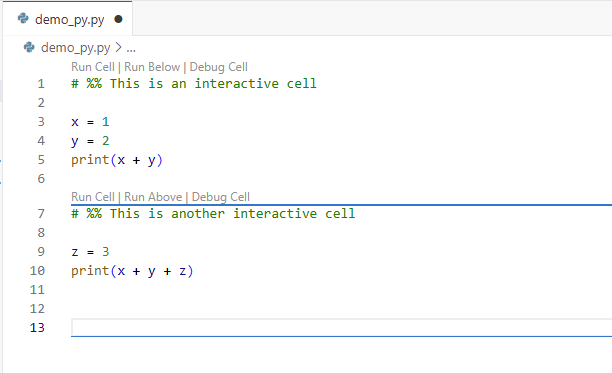
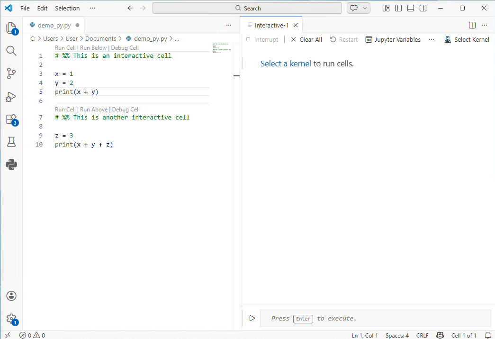
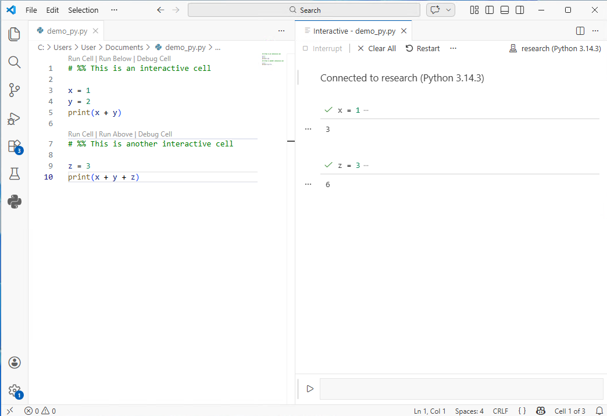
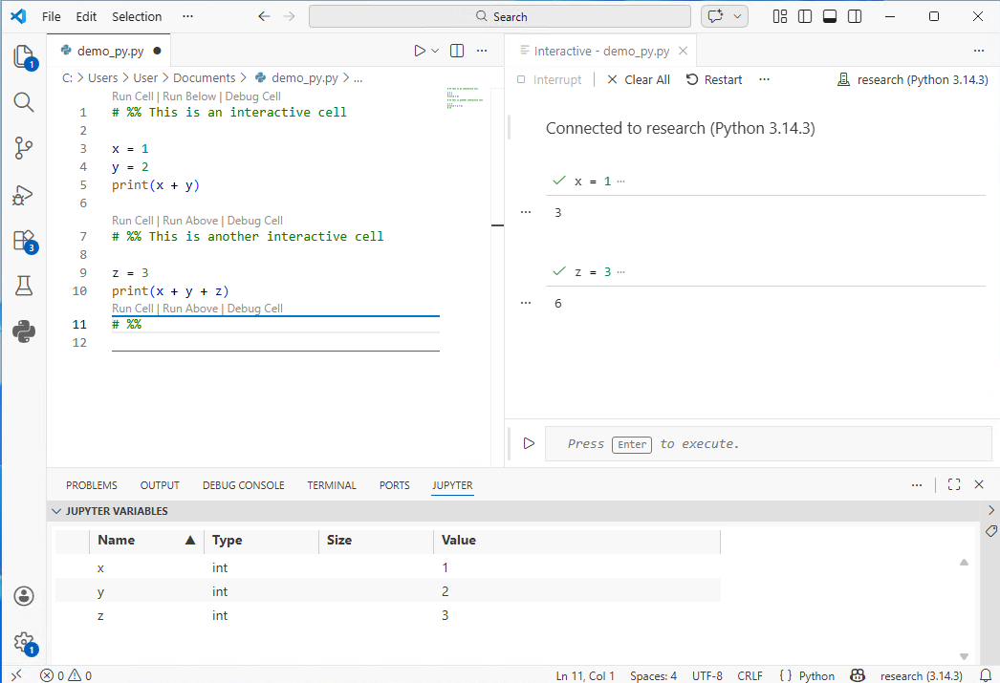

# Python with Microsoft VS Code and Conda: Getting the Most Out of Your Setup

If you have completed the [installation process for VS Code and conda](30_vs_code_with_miniforge.md), we highly recommend that you review this page for information on how to use your setup effectively.

> If you would like to use this setup, but have not yet installed and configured it, click [here](30_vs_code_with_miniforge.md). For help in determining the best Python setup for you, click [here](10_which_python_setup.md).

The reference guide below is divided into two sections:

- **Using Conda**: a helpful reference for using conda to manage environments. You may wish to refer to this page whenever you need to manage your environments or install libraries/packages.
- **Using VS Code**: a short guide to the key features and ways of programming in Python in VS Code.

Note that we provide instructions on two different styles of Python programming in our VS Code section: one that uses Jupyter Notebook files (with extension .ipynb), and one that uses Jupyter functionality within the more standard Python file (with a .py extension). The Jupyter Notebook (.ipynb) will be familiar to users coming from Google Colab, and is the recommended option for new users. Users who plan to write code that will be run from the command line or from a batch script (e.g. for scheduling jobs on the HPC) should learn to use the .py option.

## Using Conda

### Accessing Conda in a Terminal

#### Windows

For Windows users, the Miniforge distribution comes with an installation of Miniforge Prompt, which is a terminal with conda enabled. Miniforge Prompt can be found by searching your system applications. You can always use Miniforge Prompt to manage conda from the command line.

During our [setup instructions](30_vs_code_with_miniforge.md) we suggested that you run the command `conda init --all` in Miniforge Prompt to permanently activate conda access from other terminals as well, including from the terminal within VS Code. (This may not work on all system setups however, so if you find that you have trouble accessing conda from a different terminal, you can always go back to using Miniforge Prompt.)

To check if conda is enabled in your terminal, you can type `conda --version` on the command line and press enter. If it returns the word "conda" with a version number, you can use conda from that terminal. (Note that you can also activate conda by locating and running the conda executable from a terminal command line on your machine, though this method will be time-consuming and inefficient for most users.)

If you would like to use the terminal from within VS Code, open VS Code and select "Terminal" from the "View" menu.

#### MacOS

During the setup process, you should have set conda to automatically activate in the Terminal application. You can search your system for the Terminal application when you need to manage your conda environments or install packages. You can check that conda is activated in your terminal by typing `conda --version` on the command line and pressing enter. If it returns a version number, then conda is active in that terminal. If not, then you should return to the [troubleshooting instructions](30_vs_code_with_miniforge.md#conda-is-not-working-from-the-terminal-application) on the VS Code and conda setup page.

### Creating Environments

From Miniforge Prompt or a conda-enabled terminal, the simplest way to create an environment is:

```
conda create --name newenvname
```

You can replace "newenvname" with a name of your choice. (Environment names should not contain spaces. Use letters, numbers, underscores, hyphens, or periods in environment names.)

The above command will create a new environment with the most recent stable version of Python. If you prefer a specific version of Python, you can specify it as follows:

```
conda create -n myenv python=3.9
```

To see whether an environment has been created, you can type:

```
conda env list
```

This will provide a list of all your environments.

For more information on creating and managing environments, see the conda user guide: https://docs.conda.io/projects/conda/en/latest/user-guide/index.html#

### When Should I Create New Environments?

As mentioned in our installation/setup guide, it's important to note that conda comes with a special environment called the **base environment** by default. The base environment contains conda itself and the core tools needed to manage packages and environments. Unlike project-specific environments that you create for your own work, base is intended mainly for managing conda rather than for running your research or projects. Using the base environment for everyday work is discouraged. Installing packages into base can lead to dependency conflicts between projects, make your code harder to reproduce, and in some cases interfere with conda’s own functionality.

Instead of using base, you will need to create new environments to use for your research projects. Note that you do not need to create a new environment every time you do something new in Python. Many researchers will use the same environment for all their work until it comes time to update to a new version of Python. In general, it's recommended that you create new environments whenever:

1. You're embarking on a large, stand-alone project, and want to maintain a stable version of Python and all libraries necessary for that project, along with their dependencies.
1. You have a number of related projects that depend on a similar set of libraries.
1. You want to update to a newer version of Python for new projects and tasks going forward.

### Installing Libraries

Conda is a more advanced package manager than pip. To gain the full benefits and functionality of conda, you will need to develop a habit of using conda rather than pip to install your packages, except in cases where a given package is *only* available using pip.

Always be sure to activate your desired environment before installing packages. For example, if you have an environment called "myenv", you can activate it from a terminal command line by typing:

```
conda activate myenv
```

Once the environment is activated, you will see the name of the environment in parentheses at the beginning of your command prompt.

You can install a library as in the following example, using pandas as an example:

```
conda install pandas
```

You will most likely be given a prompt asking if you wish to proceed with the installation, in which case you should type `y` and press enter.

## Using VS Code

We present two ways to write Python code in VS Code:

- **Using the Jupyter Notebook extension**: this is the VS Code implementation of Jupyter Notebooks. The user experience is similar to using the standalone Jupyter Notebooks app or Google Colab, but with the added benefit of all the features of VS Code. This option is recommended for new users.
- **Using standard Python files (with extension .py) and Jupyter Interactivity**: This option allows you to code in a standard .py file with the added benefit of being able to take advantage of Jupyter interactivity. This is especially useful for those planning to run their files from a command line or shell script, as it does not require the extra step of converting a Jupyter Notebook file to a .py file.

### Using the Jupyter Notebook Extension

#### Creating a New Jupyter Notebook File and Connecting to Your Project Environment

To create a new Jupyter Notebook file, click the File menu and select "New File". A drop-down menu will appear at the top-center of your screen. If the Jupyter Notebook extension has been installed, you will have an option to select "Jupyter Notebook" from this menu.

To connect to a conda environment, look for the "Select Kernel" button in the top-right corner of your Jupyter notebook file. A drop-down menu will appear with a list of your conda environments. Select the environment you want to use.

Your environment will need the ipykernel package installed to work with Jupyter notebook. If you did not already install it when you created your environment, you will be prompted to install it when you first try to run a code cell.

##### What if my conda environment is not visible in VS Code?

Please see the [troubleshooting guide](30_vs_code_with_miniforge.md#the-newly-created-research-environment-does-not-appear-in-vs-code) in our installation and setup instructions.

#### Viewing Jupyter Variables and Data Frames in Your Jupyter Session

A useful feature of the Jupyter Notebook extension in VS Code is the option to view all variables and data frames that are currently active in your Jupyter session.

To use this feature, look for the "Jupyter Variables" button at the top of your Jupyter Notebook file. Clicking on this will open a new panel with a list of all your variables and data frames.

To view your data, you will need the Data Wrangler extension. You will be prompted to download the extension when you click on your data in the Jupyter Variables panel.

### Using standard Python (.py) files and Jupyter Interactivity

Jupyter Notebook has become popular in data analysis, research, and data science in part due to its *interactivity*, i.e. the ability to run small chunks of code and see the results side-by-side with your code cells. It is not the only way to code in Python, however; many users will also favor the standard Python file (with extension .py), depending on their personal preferences or the needs of their projects. This approach can have a few advantages, the most notable of which being that .py files can be more easily run from the command line or submitted for processing via a batch script. This is especially useful for users who need to schedule their code to run in a high-performance computing (HPC) cluster.

Fortunately, Microsoft VS Code provides an easy way to bring the interactivity of Jupyter notebooks to coding in .py files, giving you the best of both worlds. By sectioning your code in your .py file the correct way, you can create cells that can be sent to a separate Jupyter interactive window, which runs the code and displays the output.

Note that you will need the Python and Jupyter Extensions to use this setup.

### Setting up

From the File menu, select "New File". In the dropdown menu that appears at the top of your screen, select "Python File". This will open a blank .py file.

To indicate that you are creating a Jupyter cell in your .py file, you will need to use `# %%` at the beginning of a new line to indicate the start of the cell. All the code that follows this marker will be part of the cell until a new cell is created with `# %%`. See the image below for an example.



Note that (assuming the Jupyter extension is installed) VS Code will automatically detect that a cell has been created, and options for running and debugging the cell will automatically appear above the `# %%`. You can also run cells with ctrl+enter (cmd+enter on MacOS), which runs the cell, or shift+enter, which runs the cell and creates a new one.

When you run a cell, VS Code will create a new Jupyter interactive window in which to perform the operations and display the output. The window should open automatically in a separate tab. We recommend that you click and drag this tab to the right to create a split-screen view, so that you can code and see the interactive window output simultaneously, as shown in the image below.



You will need to select a kernel to run the cells in your code. Click "Select Kernel" and select your preferred environment from the drop-down menu. If you do not see your environment, please see the [troubleshooting guide](30_vs_code_with_miniforge.md#the-newly-created-research-environment-does-not-appear-in-vs-code) in our installation and setup instructions.



Once your kernel is connected, you can run the cells in your .py file to see the output in the interactive window.

Note that you can also enter and run code directly into the interactive window if you do not want to add it to your .py script. To use this option, enter your code in the shaded box at the bottom of the interactive window and press enter.

### Viewing your Jupyter Variables

As with the Jupyter Notebook setup described earlier in this document, you can open a "Jupyter Variables" window to view all Python variables currently stored in memory in your Jupyter session. Look for the "Jupyter Variables" button at the top of your interactive window to access this option. If it's hidden, click the "..." at the top of the interactive window to see more options.



You can now see all your Jupyter variables in a panel at the bottom of the screen. If you have a pandas data frame in memory, you can click on it to view your data (requires installation of the Data Wrangler extension).

## Getting Help

Congratulations on building your setup in Python. We hope you find it useful and fun!

If you need support with your Python setup and workflows, or with other data science and research topics, please reach out to us at:
datalab-support@elist.tufts.edu
