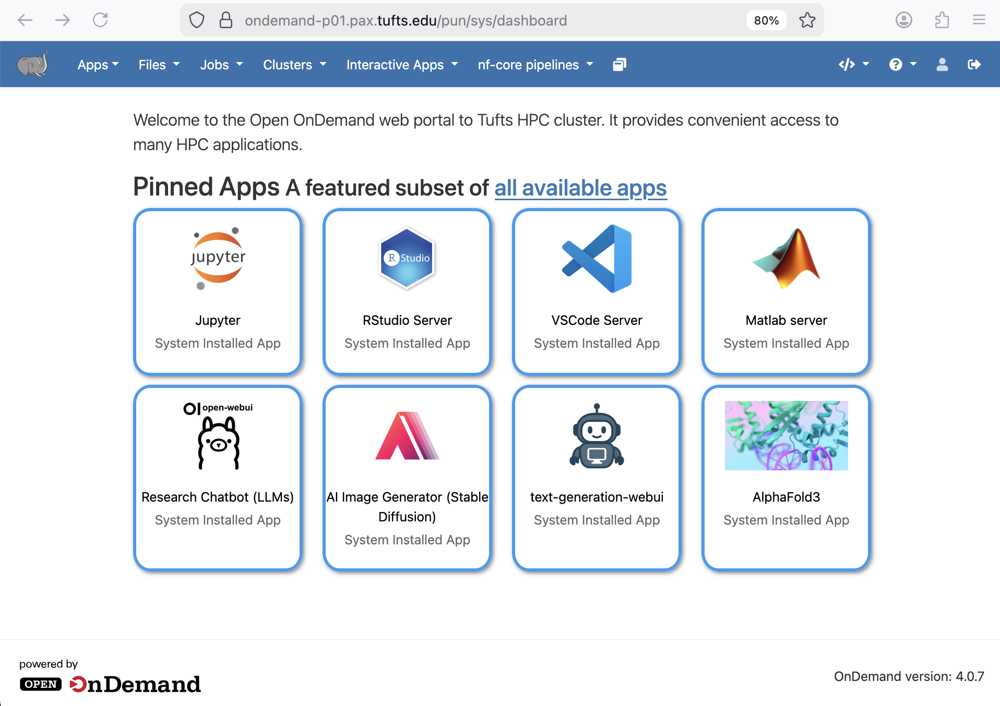
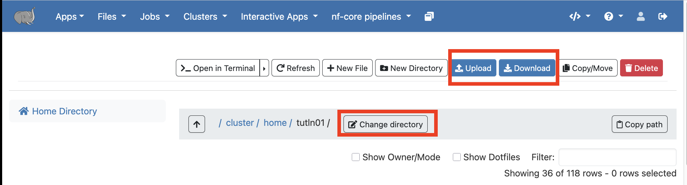
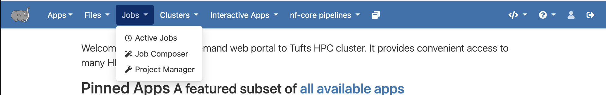
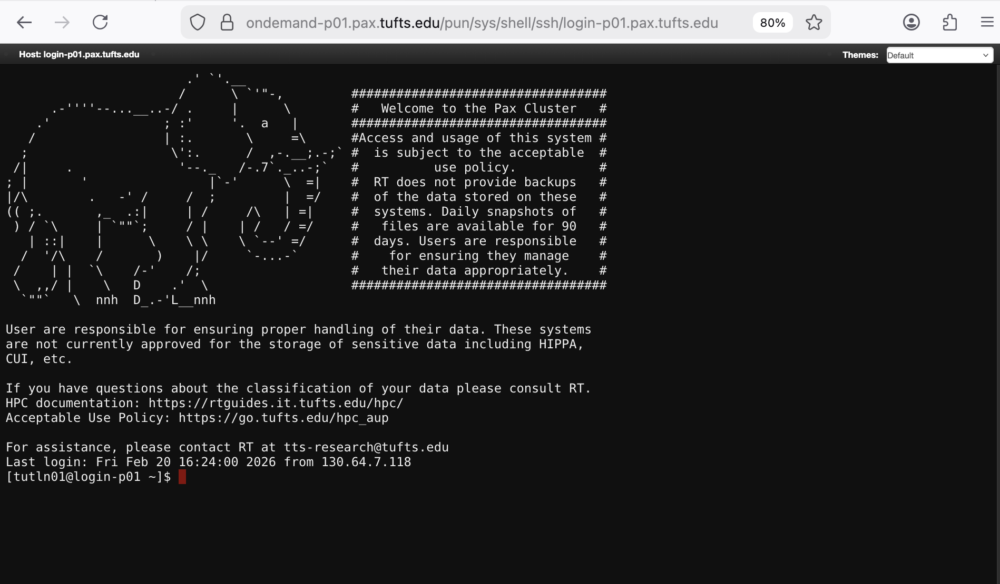
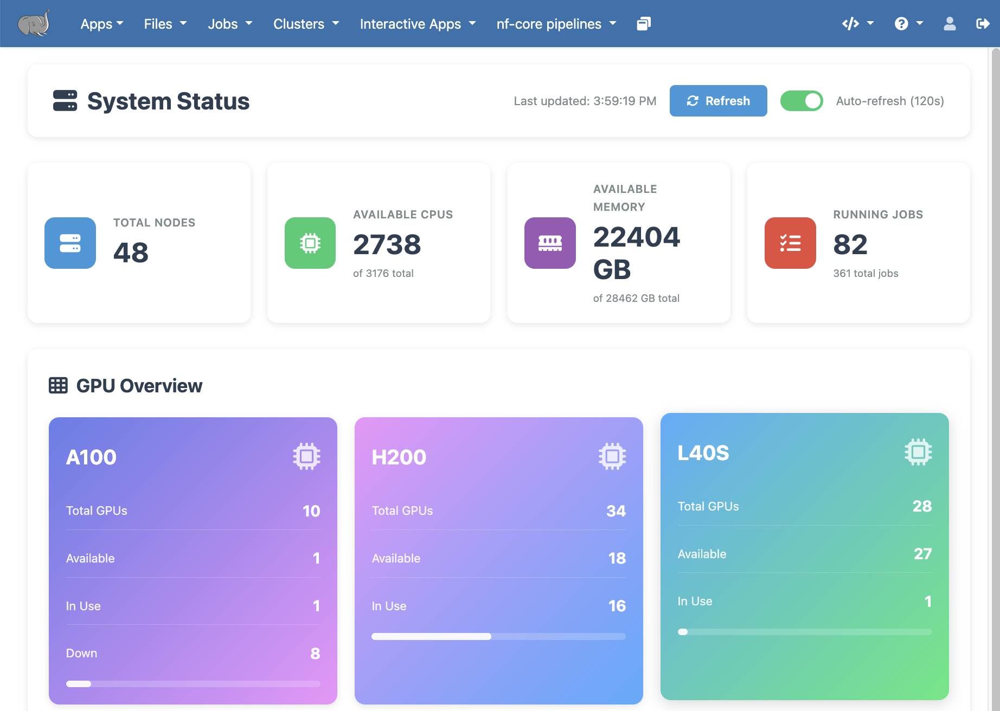
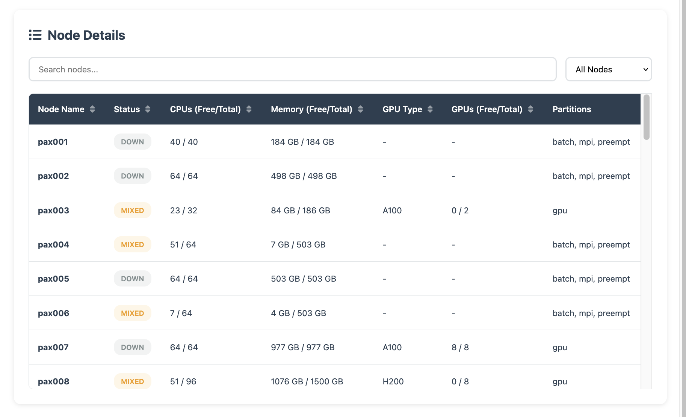
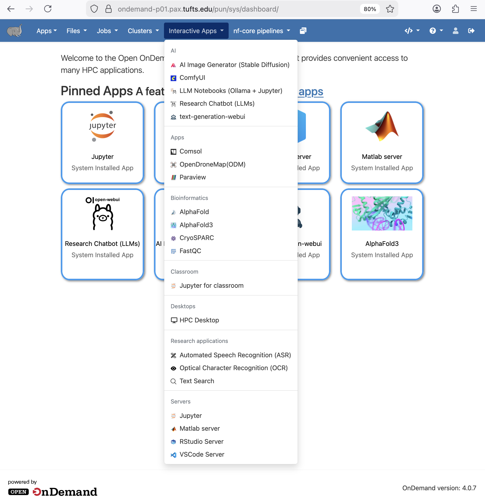

# OnDemand - Tufts HPC Cluster Web Interface

```{important}
   VPN - Off-campus access from non-Tufts Network please connect to [Tufts VPN](https://access.tufts.edu/vpn).
```

## Login

OnDemand empowers Tufts HPC community with remote web access to Tufts HPC cluster.
From a browser, go to [**OnDemand**](https://ondemand-prod.pax.tufts.edu/), https://ondemand-prod.pax.tufts.edu/
SSO - Use your **Tufts UTLN** (all lower-case) and **password** to login.


## Explore Tufts HPC OnDemand

OnDemand makes it easy to access cluster resources and your favorite software for data visualization, simulations, modeling, and more.

### Files

Access, manage, and edit your files and folders on HPC cluster directly from OnDemand using `Files` option.



Click on `Home Directory`, it will take you to `/cluster/home/your_username`
You can use the `Change directory` button to go to a different folder, such as your lab folder `/cluster/tufts/your_lab`
You can also `Upload` or `Download` files and folders to/from the cluster from/to your local computer.



### Jobs

Use `Jobs` menu to monitor and mange active jobs, lookup job histories, compose and submit new jobs, as well as create and manage projects on HPC cluster.




### Clusters

Start a terminal using **`Tufts HPC Shell Access`** in `Clusters`.


**`Tufts HPC Shell Access`** = `$ ssh your_utln@login-prod.pax.tufts.edu`



`System Status` provides an overview of cluster queue and resource status. 



It also shows node-level resource availability details:



### Interactive Apps

There are many popular GUI-ready applications available on OnDemand, such as [RStudio](../application/25-rstudio.md), Jupter, [Matlab Server](../application/matlab.md), [VSCode Server](../application/40-vscode.md), .etc



If you need X11 access through OnDemand to display any GUI applications that's not already available under `Interactive Apps`, you may use the [HPC Desktop](../application/hpc-desktop.md).


