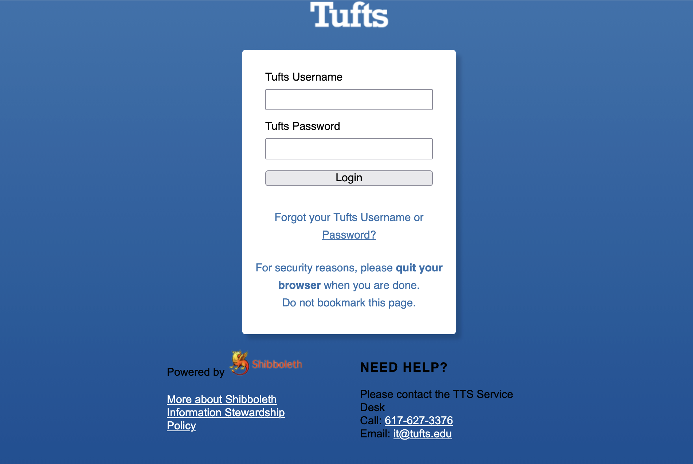

# OnDemand - Tufts HPC Cluster Web Interface

```{important}
   VPN - Off-campus access from non-Tufts Network please connect to [Tufts VPN](https://access.tufts.edu/vpn).
```
## Login

OnDemand empowers Tufts HPC community with remote web access to Tufts HPC cluster.
From a browser, go to [**OnDemand**](https://ondemand-prod.pax.tufts.edu/), https://ondemand-prod.pax.tufts.edu/
SSO - Use your **Tufts UTLN** (all lower-case) and **password** to login.




## Explore Tufts HPC OnDemand

OnDemand makes it easy to access cluster resources and your favorite software for data visualization, simulations, modeling, and more. 


### Clusters

You can start a terminal using **`Tufts HPC Shell Access`** in `Clusters`.

**`Tufts HPC Shell Access`** = `$ ssh your_utln@login-prod.pax.tufts.edu`

### 
If you need X11 access through OnDemand to display any GUI applications, please use our [OnDemand](https://ondemand-prod.pax.tufts.edu/) **`Clusters`** for this option:

**`Tufts HPC FastX11 Shell Access`** = `$ ssh -XYC your_utln@login-prod.pax.tufts.edu` (with X11 for GUI applications).

[FastX Web/Desktop Client Setup Instructions](https://tufts.box.com/s/s1vig4km289dzx8qkq4mbhlp4es0oxu1)

OR

You also have the option to use the `Xfce Terminal` under new [OnDemand](https://ondemand-prod.pax.tufts.edu/) `Interactive Apps` with limited computing resources.
