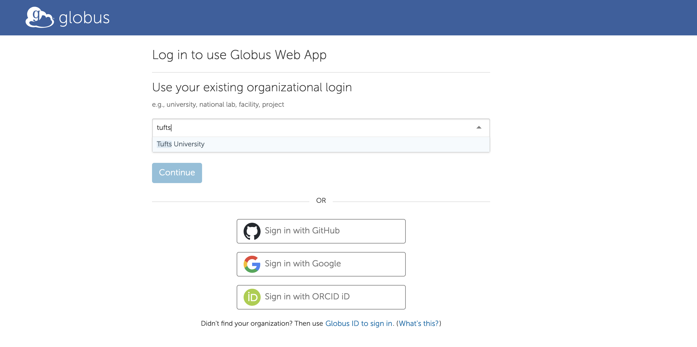
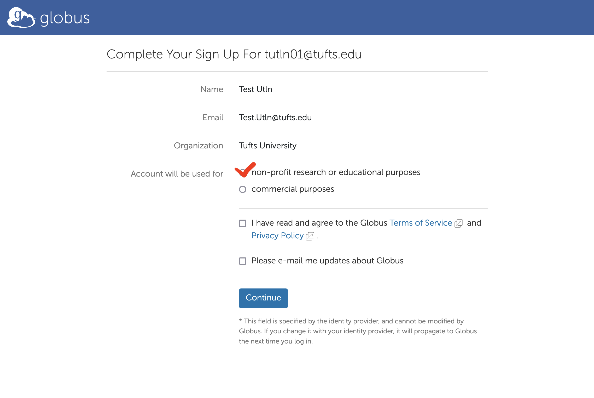
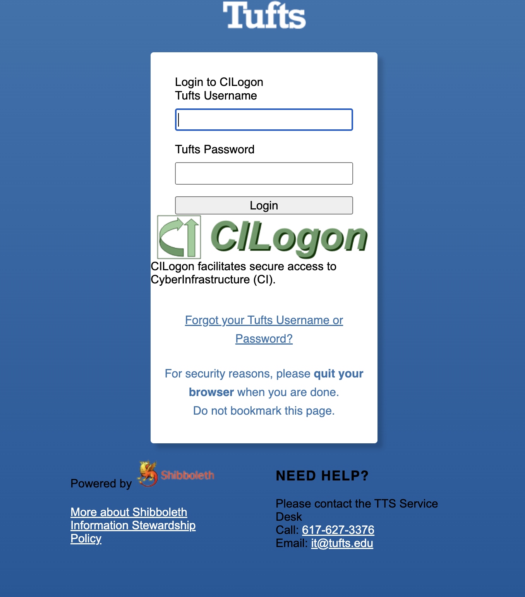
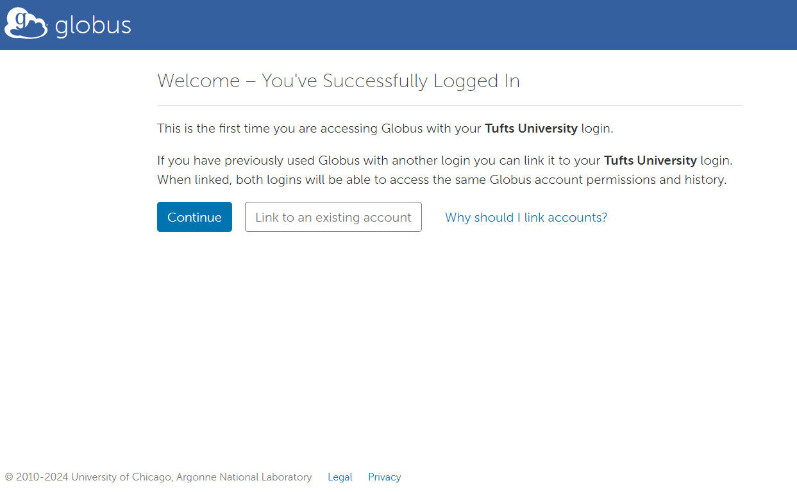
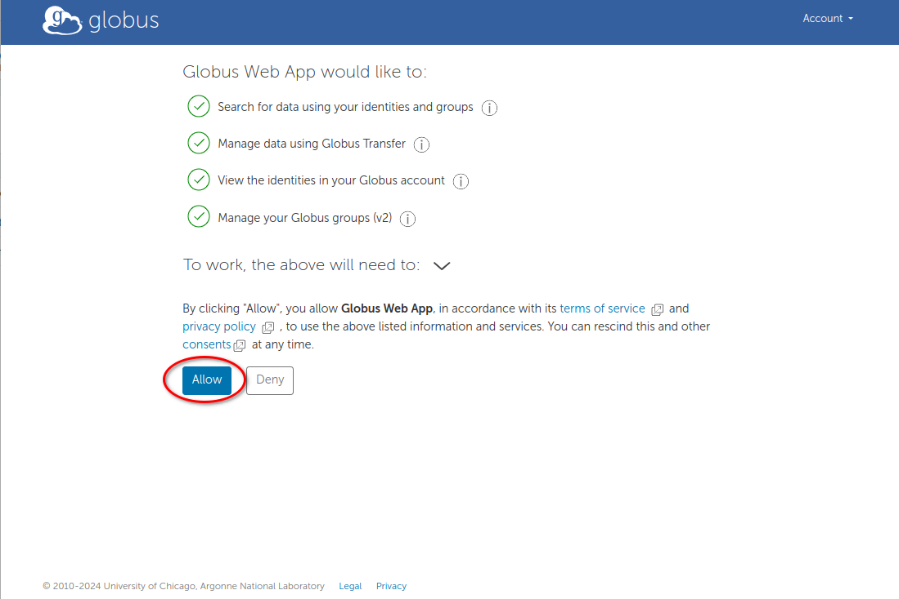

# Globus Account Setup

Tufts has a subscription to Globus, and you can set up a Globus account with your Tufts credentials.

You can also link other accounts, either personal or through other institutions.

## Link Tufts Account

Visit [www.globus.org](https://www.globus.org/) and click "Login" at the top of the page. On the Globus login page, choose "Tufts University".

Click `Continue`. This will redirect you to the Tufts Shibboleth login page (SSO).

Enter your Tufts credentials and log in.

Click `Continue` on the "Welcome – You've Successfully Logged In" page.

You may be prompted to provide additional information. Select "non-profit research or educational purposes" and agree to the "Terms of Service and Privacy Policy". Complete the form and click `Continue`.

Finally, you need to give Globus permission to use your identity to access information and perform actions (like file transfers) on your behalf.

