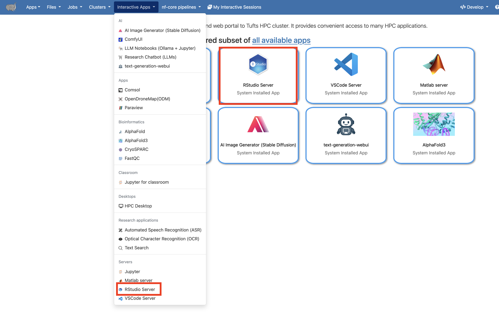
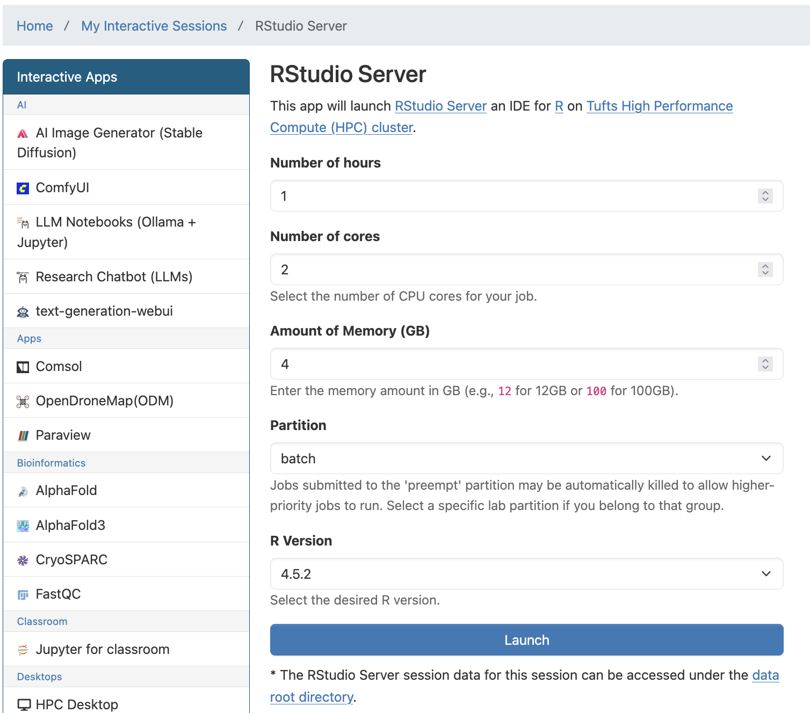
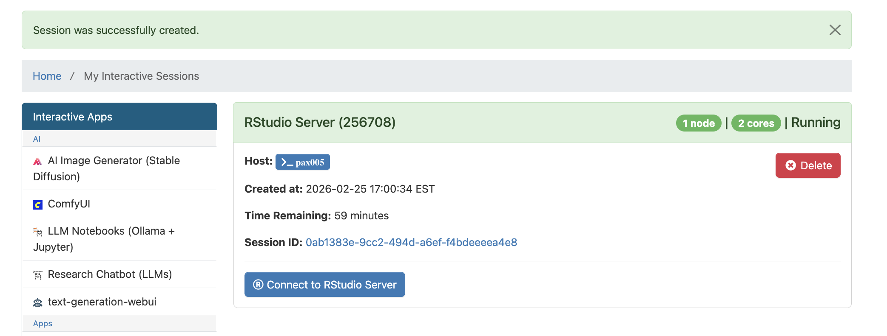

# RStudio via OnDemand

> Updates coming soon!

## Launch RStudio

1. Go to [OnDemand](https://ondemand-p01.pax.tufts.edu/) Login with Tufts SSO.
1. `RStudio Server` app is available in `Interactive Apps`

1. Fill the request form with the appropriate amount of resources needed for your work and the version of R needed. Click `Launch` to launch the session.

1. Once the resource for your session is allocated, click `Connect to RStudio Server` to start.

1. When you finished, exit RStudio properly `q()`, then close the RStudio tab, and go back to the `My Interactive Sessions` page click `Delete` to end the session and free up resources for other users.

## Debug OnDemand RStudio Pax

Logs from RStudio could be corrupted sometimes which will cause RStudio not launching from OnDemand. Here are a few things you can try. Make sure all RStudio sessions are deleted before this.

- Rename the file `/cluster/home/$USER/.local/share/rstudio`

  $ `mv /cluster/home/$USER/.local/share/rstudio /cluster/home/\$USER/.local/share/rstudio_bkp\`

- Rename the `/cluster/home/$USER/.RData`

  $ `mv /cluster/home/$USER/.RData /cluster/home/\$USER/.RData_bkp\`

Now you can try relaunch RStudio. If it's working properly for you, test out your workflow.

If you get all you need without issues, you can go ahead and delete `/cluster/home/$USER/.local/share/rstudio_bkp` and `/cluster/home/$USER/.RData_bkp`.

If you have any questions or need additional assistance, feel free to reach out to us at {{ email }}.
