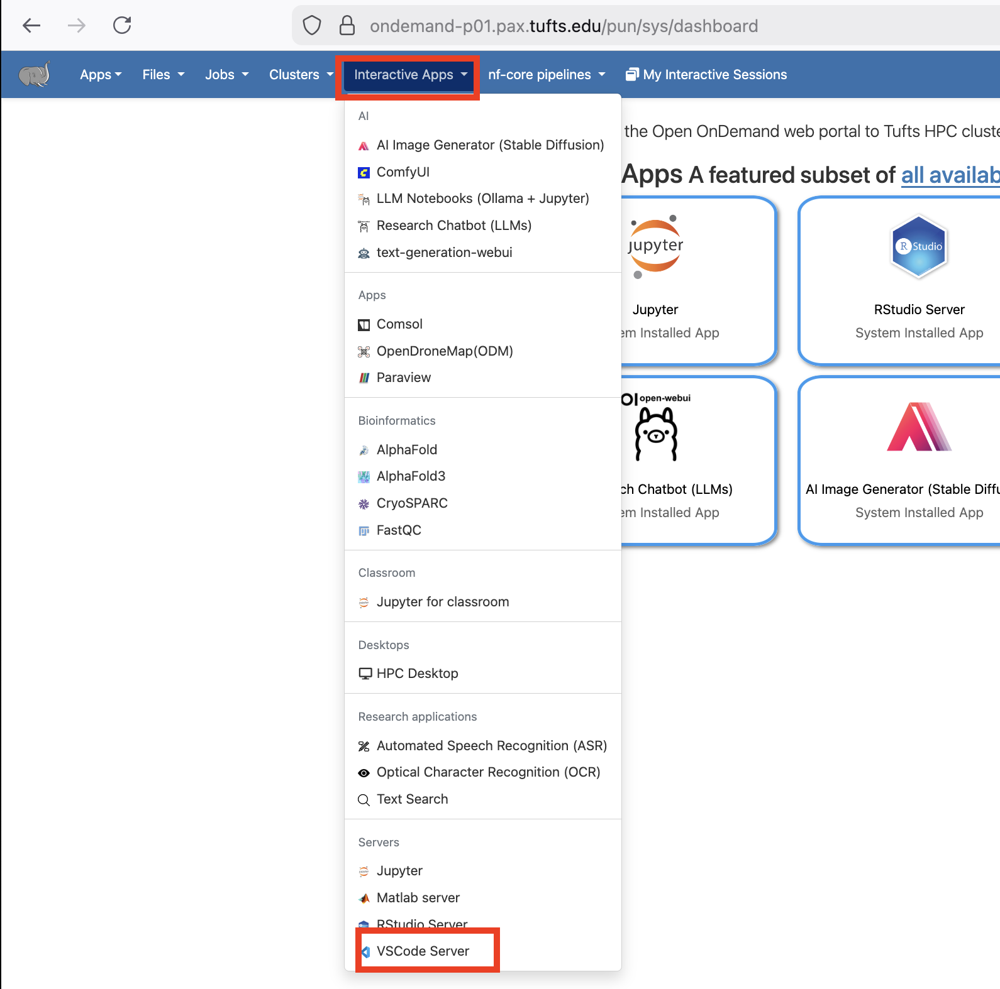
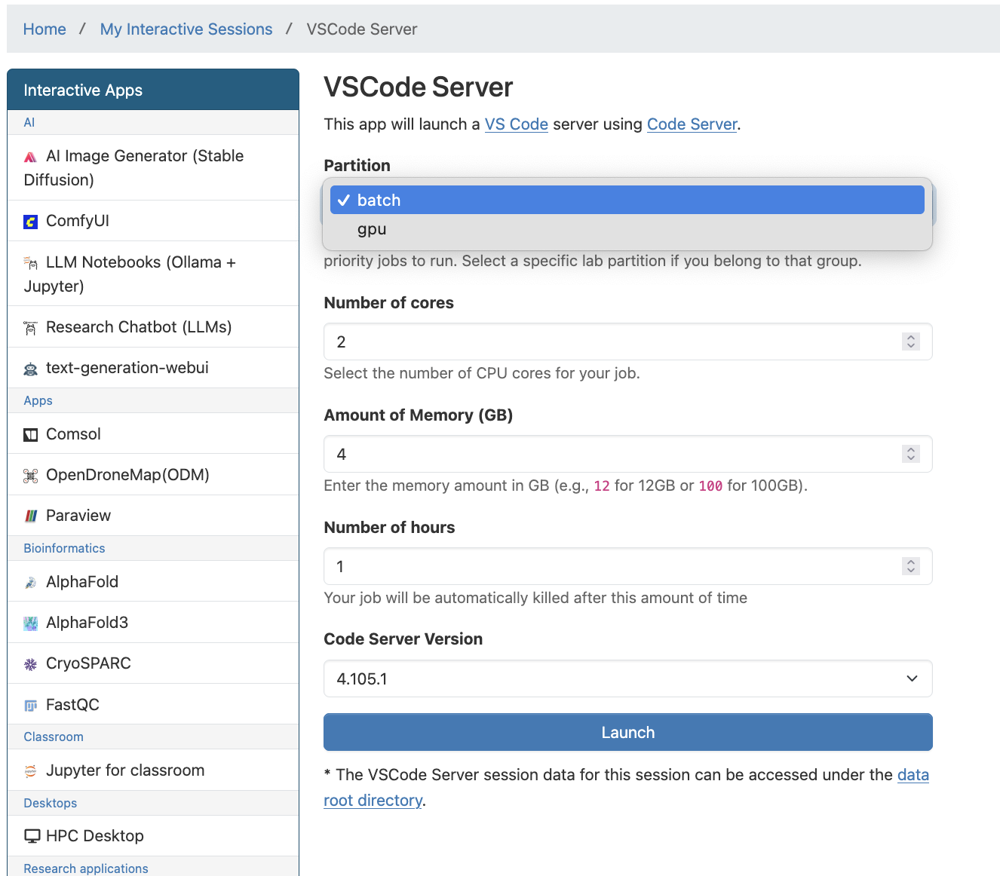
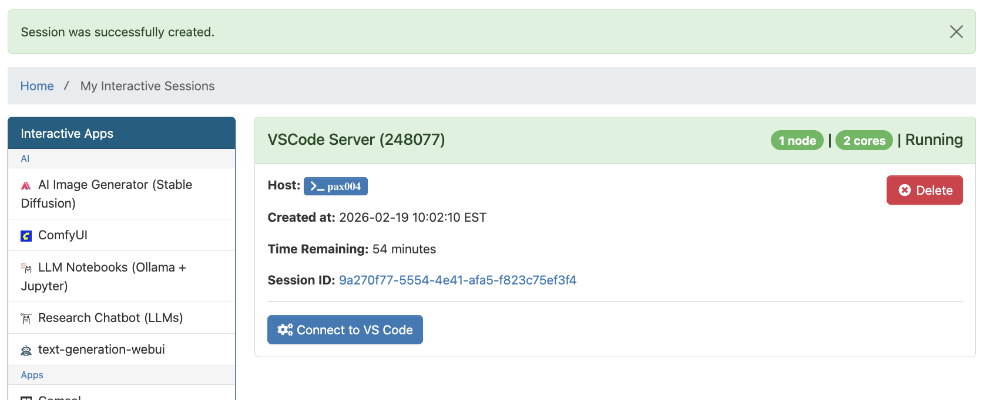
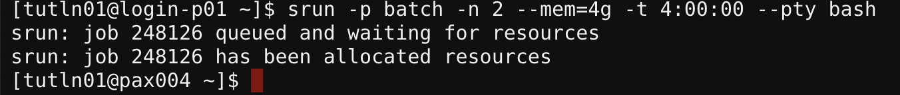
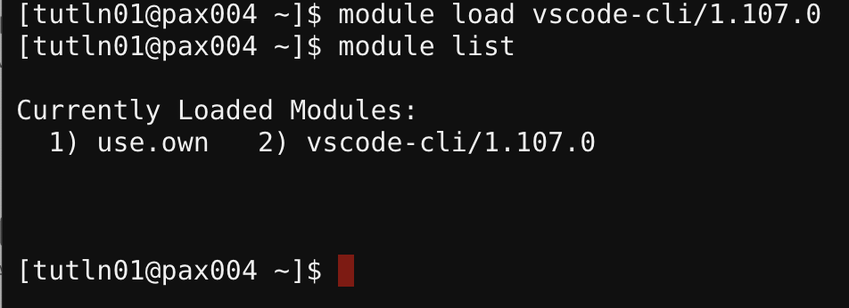
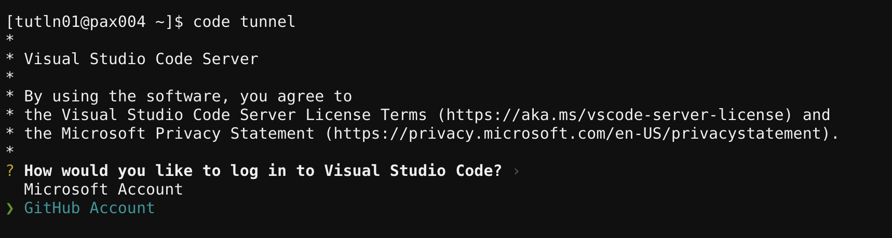
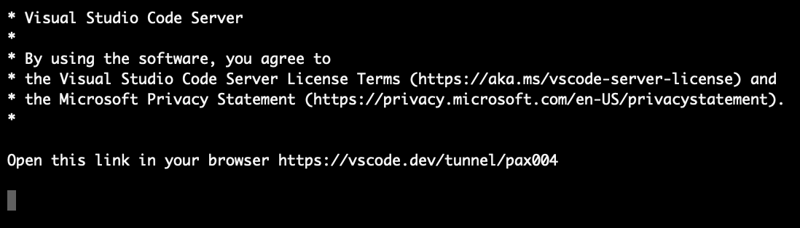
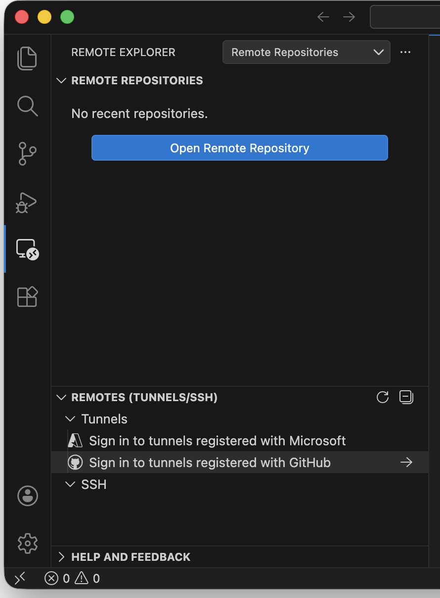
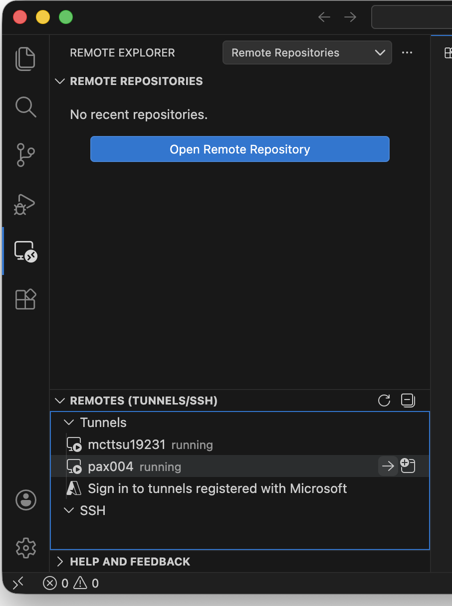

# VSCode

There are multiple ways to use VSCode with Tufts HPC Cluster resources. In this guide, we cover two supported approaches:

1. **OnDemand VSCode Server**, which runs entirely in your browser
1. **Local VSCode with a remote tunnel**, which connects your local VSCode installation to the cluster

These approaches are useful when you need to create, edit, and manage sophisticated codebases directly on the cluster. The tunneling method can also be used to run `Jupyter Notebooks` backed by cluster resources.

The tunneling workflow requires a GitHub or Microsoft account. If you do not already have a GitHub account, you can create one at [https://github.com/](https://github.com/).

## OnDemand VSCode Server

1. Log in to Tufts HPC Open OnDemand:\
   [https://ondemand-prod.pax.tufts.edu/](https://ondemand-prod.pax.tufts.edu/)

1. Select **VSCode Server** from the `Interactive Apps` menu.

1. Fill out the form and click **Launch**.\
   The VSCode Server session will run on a compute node using the resources you requested.

1. Click **Connect to VS Code**.

1. Once VSCode Server launches, you can install extensions using the **Extensions** view.

1. When finished, **delete the VSCode Server session** in Open OnDemand to free resources for other users.

**Tips on using VSCode Server**

> Note:
>
> If you are using VSCode via the VSCode Server, the File, Edit, Go, Run are not on the top of the screen like you may be used to on your local computer. These are stored in a menu with three lines (the hamburger menu) on the far left of the VSCode window.

## Local VSCode with Tunnel

### Local Extensions

To use extensions, they need to be 1) installed and 2) the system must meet all prerequisites indicated on the official extension page. These are optional, but they add additional functionality which may be important for data science workflows.

> *Example extensions*
>
> Here are some examples of useful local extensions:
>
> [Remote-SSH](https://marketplace.visualstudio.com/items?itemName=ms-vscode-remote.remote-ssh)
> [Remote Explorer](https://marketplace.visualstudio.com/items?itemName=ms-vscode.remote-explorer)
> [Remote-Tunnels](https://marketplace.visualstudio.com/items?itemName=ms-vscode.remote-server)
> [Jupyter](https://marketplace.visualstudio.com/items?itemName=ms-toolsai.jupyter) (optional)
> [Python](https://marketplace.visualstudio.com/items?itemName=ms-python.python)

Be sure to only install extensions you trust by developers you trust.

### SSH Keyless Access (Optional)

*Note: Setting up SSH Keyless Access to the HPC cluster is optional.*

You can follow the instructions here to set up your SSH keyless access. This will make your life much easier in the long run: [SSH Keyless Access](https://www.tecmint.com/ssh-passwordless-login-using-ssh-keygen-in-5-easy-steps/)

### Tunnel

To set up a tunnel from the HPC to your local computer, you will first allocate resources, load the VSCode CLI module, configure and start your tunneling session, authenticate and access VSCode, use the software, and then release resources when your work is complete.

The detailed steps to do this are below:

**1. [Tmux](30-tmux.md) Session (Optional)**

If you have a spotty internet connection or you are planning to work in the current session for a long time, using tmux can help you keep the session running even if you disconnect from the HPC cluster. Please use tmux responsibly and delete your session when you finish your work to free up resources for other users.

Start a [tmux](30-tmux.md) session on Tufts HPC cluster in any shell environment on the login node.

**2. Allocate Resources on HPC Cluster**

Allocate the appropriate amount of resources you need for your session with `srun` to start an [interactive session](../slurm/interactive.md) inside the tmux session.

> e.g. `$ srun -p batch -n 2 --mem=4g -t 4:00:00 --pty bash`

It is important to `exit` the interactive session when finished to free up resources for other users.

**3. Load Cluster VSCode CLI Module**

`$ module load vscode-cli/1.107.0`

**4. Then Configure and Start Tunnel**

`$ code tunnel`

**5. Authentication**

Reminder: You will need a GitHub or Microsoft account to follow these steps.

Follow the onscreen instructions, and any Two Factor Authentication steps from GitHub to proceed.

Once you complete these steps, you will see a message that says:\
"Congratulations, you're all set! Your device is now connected."

Go back to your interactive session on the Tufts HPC Cluster. At this point, you can choose between using your browser to access VSCode or your local VSCode instance on your computer.

- Browser Option

Once you have completed the authentication steps, copy the link given from your interactive session window into your local browser.

The link will have the form:
`Open this link in your browser https://vscode.dev/tunnel/paxXXX`

The last part of the link will change depending on how you named the machine in the previous steps.

You should now see a VSCode window running from the browser. Feel free to connect any directory by clicking on the file explorer on the left. Currently, VSCode does not support Python environments to be ported through the remote tunnel. Read more [here](https://github.com/microsoft/vscode-python/issues/21557).

- Local VSCode Option

On your locally installed VSCode, you can find your active tunnels in "Remote Explorer".

Then you can find and connect to the established tunnel to the same cluster compute node where your computing resource is allocated. This requires the [Remote-Tunnels](https://marketplace.visualstudio.com/items?itemName=ms-vscode.remote-server) extension to be installed on your VSCode. Note, as above you should confirm this is the extension provided by Microsoft.

**6. When Done**

As a reminder, when you are done with your session, be sure to be sure to end your VSCode Server session and exit the interactive session on the HPC cluster to release resources for other users.
