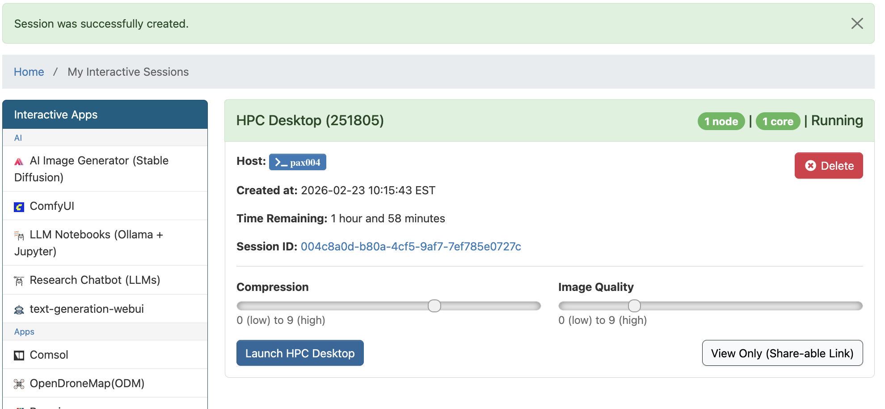
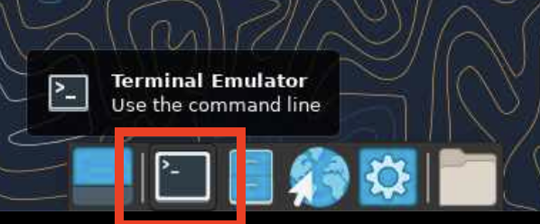
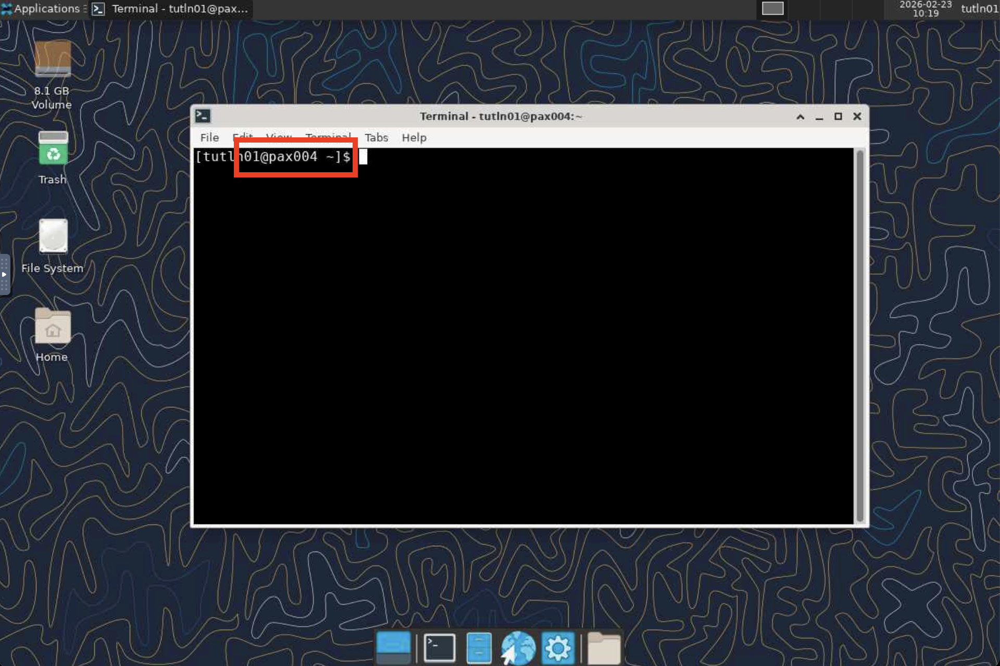
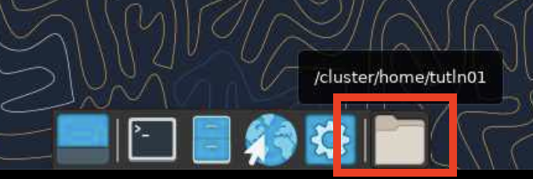
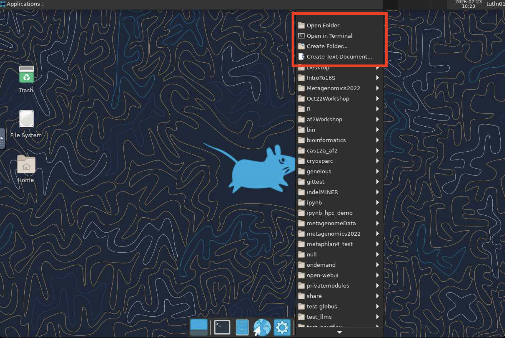
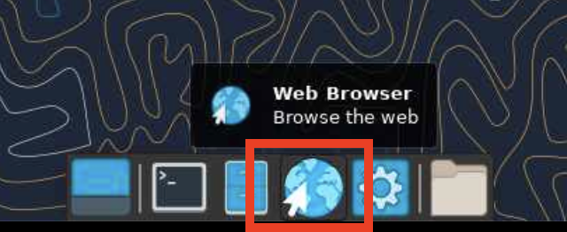

# HPC Desktop

The OnDemand **HPC Desktop** app provides a full linux graphical desktop environment accessible via web browser.

Replacement for use cases previously served via FastX.

## Start HPC Desktop

1. Log in to Tufts HPC Open OnDemand:\
   [https://ondemand-prod.pax.tufts.edu/](https://ondemand-prod.pax.tufts.edu/)

1. Select **HPC Desktop** from the `Interactive Apps` menu.

1. Fill out the form to allocate appropriate amount of resources for your work and click **Launch HPC Desktop**.\
   The HPC Desktop session will run on a compute node using the resources you requested.

   {width="60%"}

1. **Terminal**

   Once HPC Desktop launches, you can utilize the `Terminal` app to run commands on the allocated resource. Double click and open Terminal app:

   {width="60%"}

   {width="60%"}

1. **Folder**

   You can also use the "Folder" app to manage and edit files on the cluster:

   {width="60%"}
   {width="60%"}

1. **Browser**

   You can open FireFox browser using the `Browser` app:

   {width="60%"}

1. When finished, **delete the HPC Desktop session** in Open OnDemand to free resources for other users.
