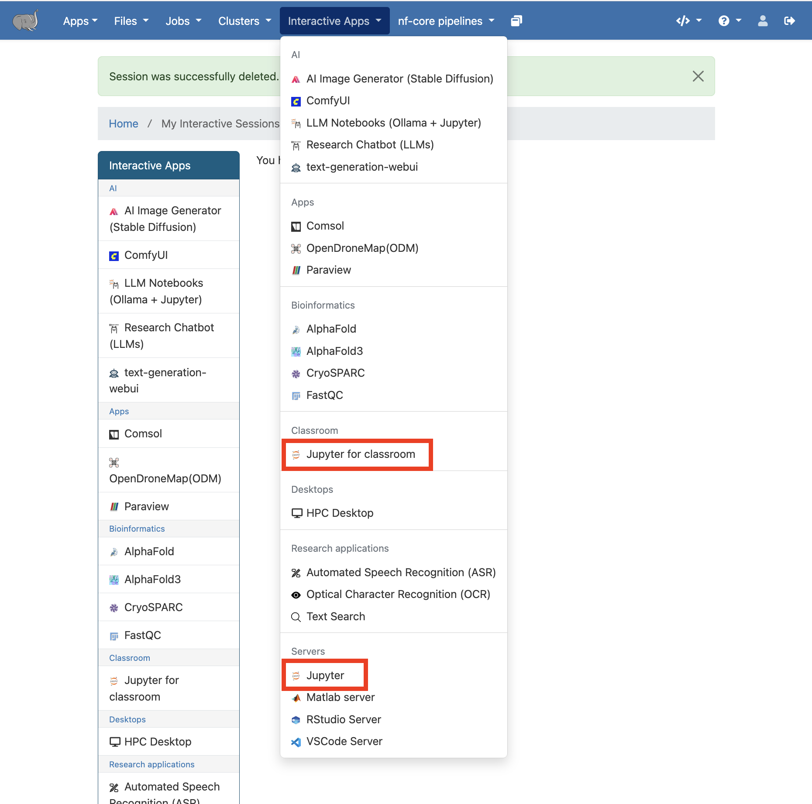
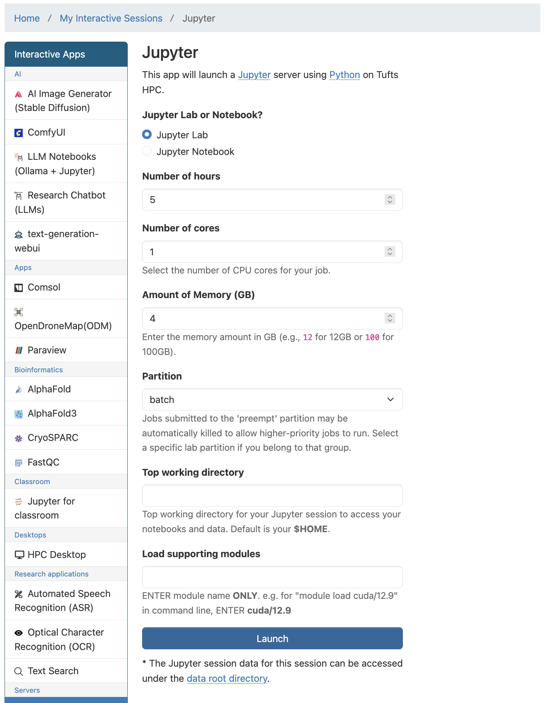
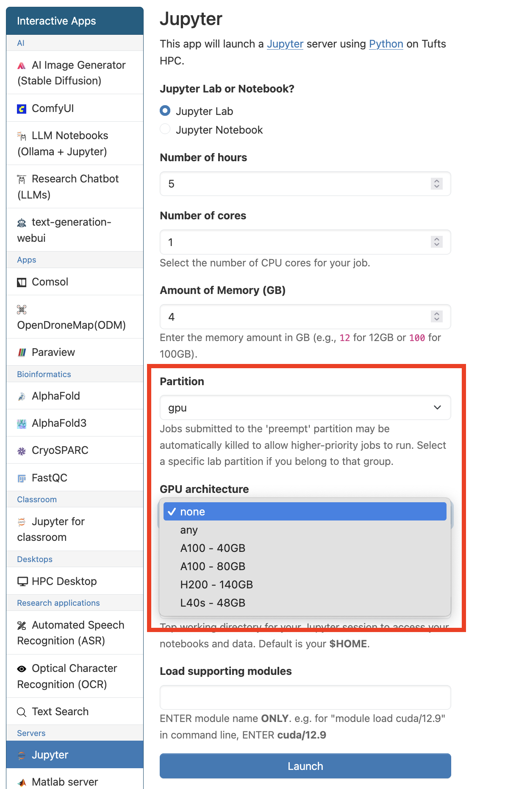
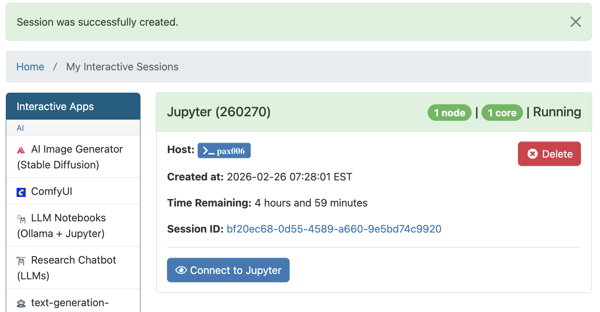
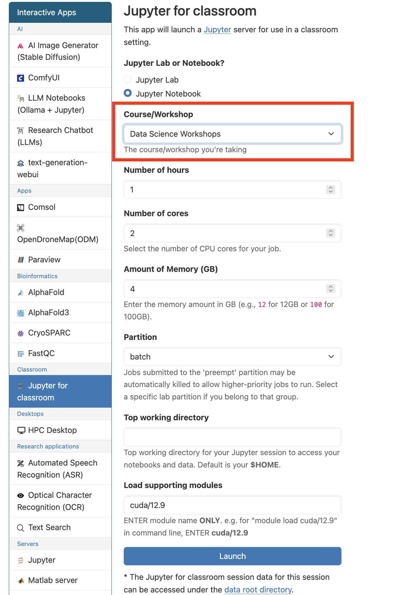
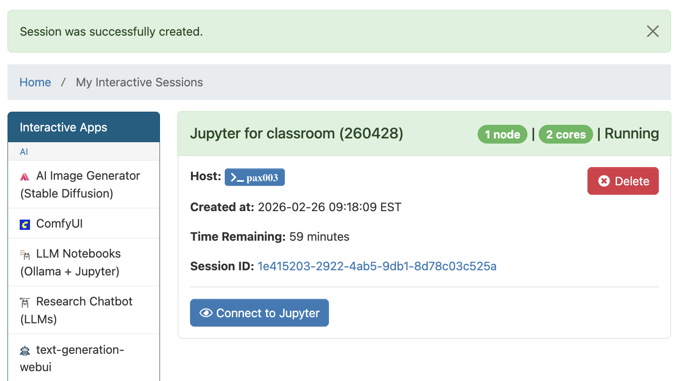
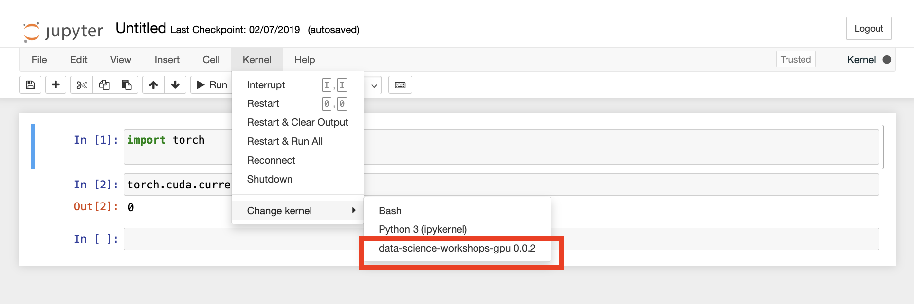

# Jupyter

> - **General and Classroom Jupyter** apps are available and supported on Tufts HPC [OnDemand](https://ondemand-prod.pax.tufts.edu/), https://ondemand-prod.pax.tufts.edu/ under `Interactive Apps`.
>
> - Both **Jupyter Notebook** and **Jupyter Lab** are available via `Jupyter` and `Jupyter for classroom` apps.

## Jupyter (General)

1. Open `Jupyter` in `Interactive Apps`. Select appropriate resources for your work.

GPUs are avalilable when `gpu` partition is selected.

Click `Launch` when you are ready.

2. Once the resource for your session is allocated, click `Connect to Jupyter` to start.

3. Default and customized kernels can be used with Jupyter.

Learn how to create your own [conda environment and Jupyter kernel](./10-condaenv.md) on Tufts HPC cluster.

4. When finished, `Delete` the Jupyter session in `My Interactive Sessions` to free resources for other users.

## Jupyter for Classroom

> - `Jupyter for classroom` is designed to support courses and workshops on HPC cluster.
>
> - Jupyter kernels are available for each listed course or workshop with preinstalled packages.
>
> - If you are teaching and interested in utilizing HPC cluster resources for your class, please review our [HPC Course Policy](../policy/course-policy.md) and submit a [HPC Course Request](https://tufts.qualtrics.com/jfe/form/SV_d7o0UZFgK1PFXnv).

1. Open `Jupyter for classroom` in `Interactive Apps`. Select the class or workshop you are attending and appropriate resources for your work.

Similar to `Jupyter` app, GPUs are avalilable when `gpu` partition is selected.

Click `Launch` when you are ready.

2. Once the resource for your session is allocated, click `Connect to Jupyter` to start.

3. Change and select the corresponding course/workshop kernel to access the preinstalled packages and start your work.

4. When finished, `Delete` the Jupyter for classroom session in `My Interactive Sessions` to free resources for other users.
