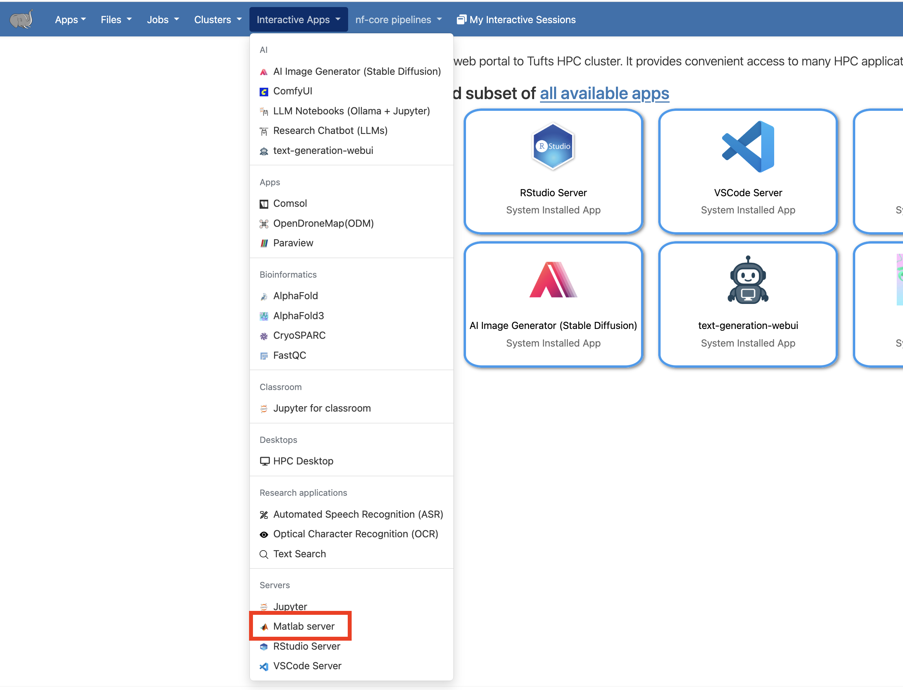
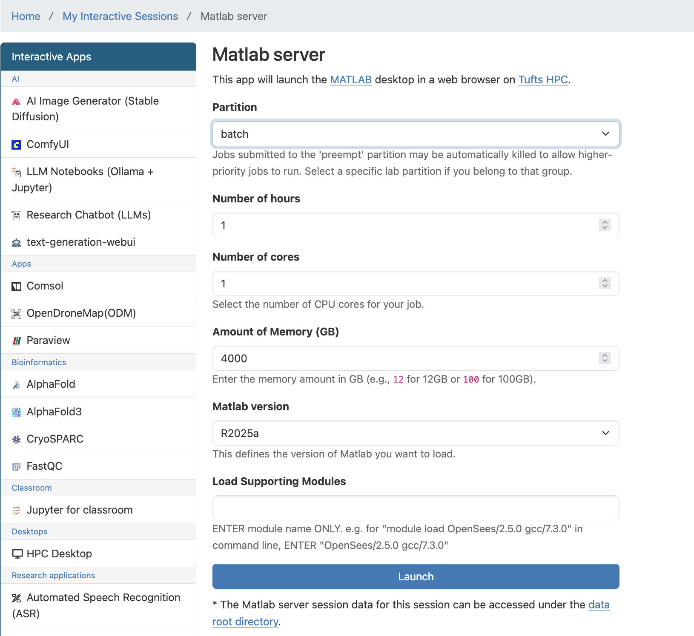
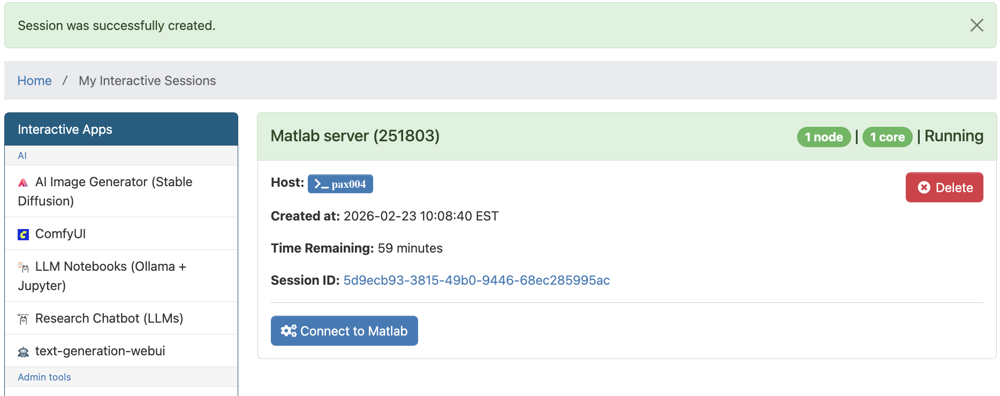

# MATLAB

There are multiple ways to use MATLAB with Tufts HPC Cluster resources. In this guide, we cover two supported approaches:

1. **OnDemand Matlab Server**, which runs entirely in your browser
1. **Matlab Batch Jobs via Command Line**, which runs on cluster in the background

## OnDemand Matlab Server

1. Log in to Tufts HPC Open OnDemand:\
   [https://ondemand-prod.pax.tufts.edu/](https://ondemand-prod.pax.tufts.edu/)

1. Select **Matlab Server** from the `Interactive Apps` menu.

   {width="60%"}

1. Fill out the form and click **Launch**.\
   The Matlab Server session will run on a compute node using the resources you requested.

   {width="60%"}

1. Click **Connect to Matlab Server**.

   {width="60%"}

1. When finished, **delete the Matlab Server session** in Open OnDemand to free resources for other users.

## MATLAB Batch Jobs on HPC Cluster via Command Line

Matlab batch job refers to running Matlab scripts or Matlab commands in a batch mode, where the job is submitted to the computing cluster's scheduler to be executed asynchronously. Batch jobs are typically used for computationally intensive tasks or tasks that require significant processing time, as they allow users to submit jobs and continue working without having to wait for the job to complete. This approach is useful for running Matlab scripts that involve large datasets, complex calculations, or simulations that may take a long time to finish.

**Steps:**

1. Login to the HPC cluster

1. Upload your Matlab script or create your own on HPC cluster

1. Go to the directory/folder which contains your Matlab script, e.g.:

`$ cd /cluster/tufts/xxxlab/username/myfolder`

4. Open your favorite text editor and write a slurm submission script similar to the following one `batchjob.sh` (name your own)

   ```
   #!/bin/bash
   #SBATCH -J my_matlab_job      #job name
   #SBATCH --time=00-00:20:00    #requested time
   #SBATCH -p batch              #running on "batch" partition/queue
   #SBATCH -n 1                  #1 CPU core total
   #SBATCH --mem=2g              #requesting 2GB of RAM total
   #SBATCH --output=myjob.%j.out #saving standard output to file
   #SBATCH --error=myjob.%j.err  #saving standard error to file
   #SBATCH --mail-type=ALL       #email optitions
   #SBATCH --mail-user=Your_Tufts_Email@tufts.edu

   #Below this point, are the commands executed on the computing resource allocated
   module purge
   module load matlab/R2025a
   #run matlab script
   matlab -nodisplay -nojvm -nodesktop -nosplash < test.m
   ```

1. Submit it with

   `$ sbatch batchjob.sh`

> NOTE: If you are submitting multiple batch jobs to run the same Matlab script on different datasets, please make sure the results are saved to unique files inside of your Matlab script.

> Learn more about [slurm batch job](../slurm/batchjob.md)
