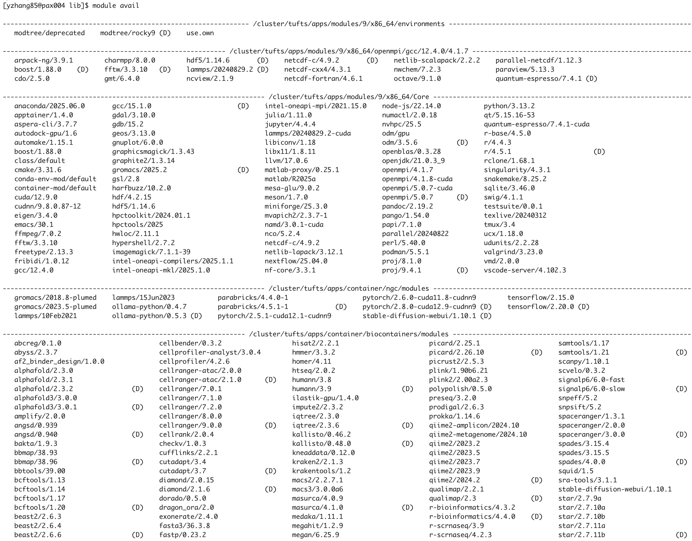
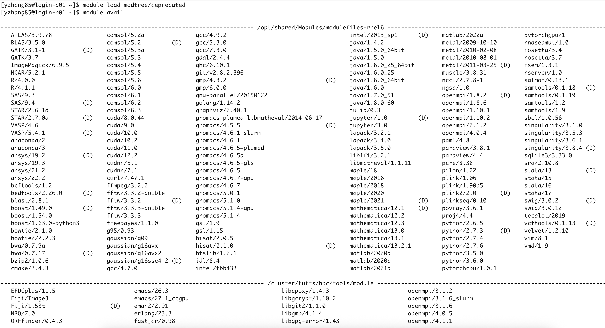

### Scientific Applications on Tufts HPC

The upgraded cluster continues to use the **Lmod modules system** to manage and load software. Most applications are now provided in newer versions, and all module names have been standardized in **lowercase**.  

Our software environment has been completely rebuilt with **Spack**, which introduces a **hierarchical module system**. This approach improves compatibility, prevents conflicts, and keeps the module listings cleaner for users.

#### Major Changes and Notes

- All applications have been rebuilt with updated versions for the new **Rocky Linux 9.6** operating system.  
- Legacy software stacks are still available (though they may not work reliably) and can be accessed with:  
  - `module load modtree/deprecated`  
- Modules are organized in a **hierarchical structure**:  
  - compiler → MPI → applications  
- All module names are written in **lowercase**.  
- Modules with **NVIDIA GPU support** include the `-cuda` suffix. For example:  
  - lammps/20240829.2-cuda
  - quantum-espresso/7.4.1-cuda


#### Default Available Modules

When you log in, you will see a default set of modules that are available without loading anything else. These include:  

- Compilers, MPI libraries, and commonly used applications (e.g., `anaconda`, `r`)  
- Applications built with the default compiler `gcc/12.4.0`  
- Applications built with `gcc/12.4.0` and `openmpi/4.1.7`  
- Bioinformatics applications  
- Containerized applications with GPU support (e.g., `pytorch`, `tensorflow`)  

---


#### The Module Hierarchy

Think of the module system as a **tree**.  
- At the base (the “Core”), you see only general tools and compilers.  
- Once you choose a compiler, the system reveals the MPI libraries available with that compiler.  
- After selecting both a compiler and an MPI, you can see all the applications built with that combination.  

This design ensures that you only see software compatible with your chosen environment.  


```
Core (common tools: anaconda, r, etc.)
│
├── gcc/12.4.0
│   ├── openmpi/4.1.7 → Applications
│   ├── openmpi/5.0.7 → Applications
│   └── mvapich2/2.3.7-1 → Applications
│
├── gcc/15.1.0
│   ├── openmpi/4.1.7 → Applications
│   ├── openmpi/5.0.7 → Applications
│   └── mvapich2/2.3.7-1 → Applications
│
└── intel-oneapi-compilers/2025.1.1
    ├── openmpi/4.1.7 → Applications
    ├── openmpi/5.0.7 → Applications
    ├── mvapich2/2.3.7-1 → Applications
    └── intel-oneapi-mpi/2021.15.0 → Applications
```

###### Core / Compiler Level
When you first log in, you will see a set of "Core" modules (common tools like anaconda, r, etc.) and the main compiler modules.

- gcc@12.4.0
- gcc@15.1.0
- intel-oneapi-compilers/2025.1.1

###### MPI Level
Once you load a compiler, the system will reveal the MPI (Message Passing Interface) libraries that were built with that specific compiler.
- openmpi/4.1.7
- openmpi/5.0.7
- mvapich2/2.3.7-1
- intel-oneapi-mpi/2021.15.0

###### Application Level

After you load both a compiler and an MPI library, the system will show you all the scientific applications (like GROMACS, VASP, etc.) that were built with that exact combination.

This structure guarantees that you can't accidentally load an application built with Intel MPI if you have GCC and OpenMPI loaded.

#### Behind the Scene - the MODULEPATH environment variable
For those curious about how the hierarchical system works, the magic is managed by an environment variable called `MODULEPATH`. This variable tells the module command which directories to search for available module files.

When you load a module, it can automatically add a new directory to your `MODULEPATH`. This action makes the next level of modules visible to you.

###### An Example of MODULEPATH in Action
Before loading anything, your `MODULEPATH` points to the default locations, including the Core and Compiler level modules:
```
$ echo $MODULEPATH
/cluster/tufts/apps/modules/9/x86_64/environments:/cluster/tufts/apps/modules/9/x86_64/openmpi/gcc/12.4.0/4.1.7:/cluster/tufts/apps/modules/9/x86_64/Core:/cluster/tufts/apps/container/ngc/modules:/cluster/tufts/apps/container/biocontainers/modules:/usr/share/modulefiles/Linux:/usr/share/modulefiles/Core:/usr/share/lmod/lmod/modulefiles/Core
```

Now, load a compiler like `gcc/15.1.0`:
```
$ module avail gcc/15.1.0
```

If you check `MODULEPATH` again, you'll see a new path has been added to the beginning of the list. This new path points to modules that depend on gcc/15.1.0.
```
$ echo $MODULEPATH
/cluster/tufts/apps/modules/9/x86_64/gcc/15.1.0:/cluster/tufts/apps/modules/9/x86_64/environments:/cluster/tufts/apps/modules/9/x86_64/openmpi/gcc/12.4.0/4.1.7:/cluster/tufts/apps/modules/9/x86_64/Core:/cluster/tufts/apps/container/ngc/modules:/cluster/tufts/apps/container/biocontainers/modules:/usr/share/modulefiles/Linux:/usr/share/modulefiles/Core:/usr/share/lmod/lmod/modulefiles/Core
```

After loading `gcc/15.1.0`, running `module avail` will display the application modules that were built with this compiler.


**The key takeaway is that you will only see modules that are compatible with the compiler and MPI library you have already loaded. This prevents errors and keeps the list of available modules clean and relevant.**

On systems in which a hierarchical structure is used, some of modulefiles will only be available after the root modulefile is loaded. The Lawrencium cluster uses a hierarchical structure for several packages that depend on a particular compiler and/or MPI package. For example, after loading gcc/11.4.0 and openmpi/4.1.6 in the example above, module avail will show new packages that can now be loaded:


#### How to use the old software stack?

For users who still rely on older software versions, the legacy RHEL6/7/8 software stack is available. These modules were originally built on Red Hat Enterprise Linux 6, 7, or 8 and may not function correctly on the new Rocky Linux 9.6 operating system.

You can enable the legacy software stack by running:
```
$ module load modtree/deprecated
```

```{attention}
These modules may not work reliably on the new cluster. We recommend migrating to more recent versions of your software whenever possible.
```



To return to the new software stack, run:

```
$ module unload modtree/deprecated
```

If you need assistance, please contact us at [tts-research@tufts.edu](mailto:tts-research@tufts.edu).


#### How to search for avaiable modules?

| Aspect            | `module avail`                                                                 | `module spider`                                                                 |
|-------------------|---------------------------------------------------------------------------------|---------------------------------------------------------------------------------|
| **Purpose**       | Shows what modules are *currently visible* in your environment.                 | Searches the *entire module tree*, including hidden modules.                     |
| **Visibility**    | Limited by hierarchical rules (depends on loaded compiler/MPI).                 | Ignores hierarchy — shows all versions and toolchains.                           |
| **Use Case**      | Quick check: “What can I load right now?”                                       | Discovery: “What software exists and how do I load it?”                          |
| **Dependencies**  | Does *not* explain why something is missing.                                    | Explains required prerequisites (compiler/MPI/CUDA).                             |
| **Example**       | `module avail gromacs` may show **nothing** until compiler+MPI are loaded.      | `module spider gromacs` shows all versions and instructions for loading them.    |
| **Best For**      | Browsing within your *current environment*.                                     | Finding software across *all environments* and learning how to enable it.        |

**Example**

Use module spider to search for all available `gromacs` modules. The command also shows which compiler and MPI modules must be loaded. Once you know the prerequisites, you can load the specific `gromacs` version — even if it was built on the older cluster toolchain.
```

$ module spider gromacs
-----------------------------------------------------------------------------------------------------------------------------------------------------------------------------------------
  gromacs:
-----------------------------------------------------------------------------------------------------------------------------------------------------------------------------------------
     Versions:
        gromacs/4.5.5
        gromacs/4.6.1-slurm
        gromacs/4.6.1
        gromacs/4.6.5+plumed
        gromacs/4.6.5d
        gromacs/4.6.5-gls
        gromacs/4.6.5
        gromacs/4.6.7-gpu
        gromacs/4.6.7
        gromacs/5.0.1
        gromacs/5.1.0
        gromacs/5.1.4-gpu
        gromacs/5.1.4
        gromacs/2018.8-gcc-8.5.0-nmiyrcw
        gromacs/2018.8-gcc-8.5.0-xdrzfdk
        gromacs/2018.8-plumed
        gromacs/2021.3
        gromacs/2022.5-gcc-8.5.0-tpbbv77
        gromacs/2022.5-gcc-8.5.0-tznaxci
        gromacs/2022.5
        gromacs/2023
        gromacs/2023.2
        gromacs/2023.3_gcc_9.3.0_cuda
        gromacs/2023.3_gcc_9.3.0
        gromacs/2023.5-plumed
        gromacs/2025.2
     Other possible modules matches:
        gromacs-plumed-libmatheval  openmpi/5.0.7-mrxzj45/gromacs

-----------------------------------------------------------------------------------------------------------------------------------------------------------------------------------------
  To find other possible module matches execute:

      $ module -r spider '.*gromacs.*'

-----------------------------------------------------------------------------------------------------------------------------------------------------------------------------------------
  For detailed information about a specific "gromacs" package (including how to load the modules) use the module's full name.
  Note that names that have a trailing (E) are extensions provided by other modules.
  For example:

     $ module spider gromacs/2025.2
-----------------------------------------------------------------------------------------------------------------------------------------------------------------------------------------
```
Running `module spider gromacs` lists all available gromacs versions, including those built on both the old and new cluster toolchains. To see the exact steps required to load a specific version (for example, `gromacs/2023.3_gcc_9.3.0_cuda`), use:
```
$ module spider gromacs/2023.3_gcc_9.3.0_cuda

-----------------------------------------------------------------------------------------------------------------------------------------------------------------------------------------
  gromacs: gromacs/2023.3_gcc_9.3.0_cuda
-----------------------------------------------------------------------------------------------------------------------------------------------------------------------------------------

    You will need to load all module(s) on any one of the lines below before the "gromacs/2023.3_gcc_9.3.0_cuda" module is available to load.

      modtree/deprecated

    Help:
      GROMACS (GROningen MAchine for Chemical Simulations) is a molecular
      dynamics package primarily designed for simulations of proteins, lipids
      and nucleic acids. It was originally developed in the Biophysical
      Chemistry department of University of Groningen, and is now maintained
      by contributors in universities and research centers across the world.
      GROMACS is one of the fastest and most popular software packages
      available and can run on CPUs as well as GPUs. It is free, open source
      released under the GNU General Public License. Starting from version
```

We can see that `gromacs/2023.3_gcc_9.3.0_cuda` was built on the old cluster, and to use it, we have to load ` modtree/deprecated` first.
```
$ module load modtree/deprecated
$ module load gromacs/2023.3_gcc_9.3.0_cuda
```