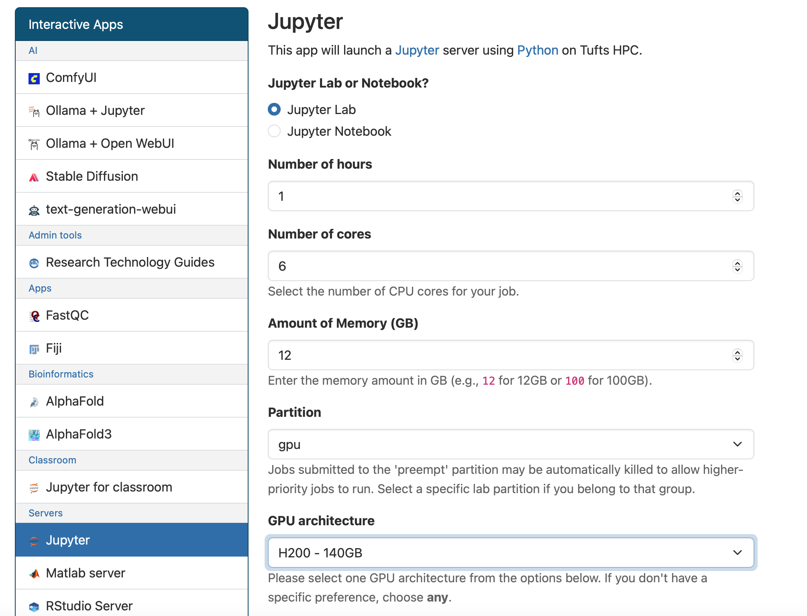

### Open OnDemand
Open OnDemand, developed by the Ohio Supercomputer Center ([OSC](https://www.osc.edu/)), is a web-based portal that makes high-performance computing (HPC) resources more accessible to a wider audience. It provides a user-friendly, graphical interface to manage and interact with HPC clusters, eliminating the need for command-line knowledge or complex client software installations. 

During our 2025 cluster upgrade, we also build a new Open OnDemand Server with the new version 4.1 to replace our old OnDemand server v1.8. Upgrading Open OnDemand from version 1.8 to 4.1 represents a massive leap forward in features, stability, and security. Given that Open OnDemand 1.8 was released several years ago, the jump to a much more recent version incorporates years of community-driven development and best practices.

Here are some of the key benefits you can expect from this upgrade:

- **A Modern and Intuitive Interface**: The new user interface is cleaner, more organized, and easier to navigate. This means less time figuring out the portal and more time on your research.

- **Easier Job Submission and Monitoring**: The new job composer makes it simpler to create and submit jobs. You can also view more detailed information about your running and completed jobs, helping you track their progress and troubleshoot any issues.

- **Rebuilt Apps**: The updated platform supports more features, allowing us to build more interactive apps.

- **Better File Management**: The file explorer is more responsive and offers better functionality for uploading, downloading, and managing your files on the cluster.

- **More Stable and Reliable**: The new version includes numerous bug fixes and performance improvements, which means fewer crashes and a smoother overall experience.

#### Featured apps
##### Jupyter
`Jupyter Notebook` and `JupyterLab` have been combined into a single `Jupyter` app on the new cluster. This app provides the latest version of Jupyter and allows you to choose your preferred mode: Jupyter Notebook or JupyterLab.

In addition, the new Jupyter app supports requesting NVIDIA GPUs to accelerate your workflows.

#### RStudio
The previous apps `RStudio Pax`, `RStudio for Bioinformatics`, and `RStudio for scRNA-Seq` have been merged into a single `RStudio Server` app, now running the latest **R v4.5.1**.

This new RStudio app comes with over 1,400 pre-installed R packages commonly used in Bioinformatics, Data Science, GIS, and related fields. For most users, these packages will cover your needs. If a package you require is not included, you can still install additional packages in your own environment.

#### Visual Studio Code
The most popular code editor Visual Studio Code (VS Code) is now available on our HPC cluster through Open OnDemand.

With this new app, you can:
- Launch VS Code directly from your web browser—no desktop installation required.
- Edit, run, and manage your HPC files and projects in an intuitive IDE.
- Install and manage your own VS Code extensions to customize your development environment.

#### Matlab server
MATLAB Server is now available on our HPC cluster through Open OnDemand. This replaces the older MATLAB Desktop GUI app.

**Advantages of MATLAB Server vs. MATLAB Desktop GUI**
- Performance: Faster and more responsive—no lag from X11 or remote desktop forwarding.
- Browser Access: Runs directly in your web browser—no client installation needed.

#### nf-core pipelines
[nf-core](https://nf-co.re/) is a collaborative initiative within the scientific community aimed at developing standardized, high-quality pipelines for various bioinformatics analyses using [nextflow](https://www.nextflow.io/). As of now, there are over 130 pipelines in nf-core that support a wide range of bioinformatics analysis tasks such as RNA-Seq, ancient DNA and metagenomics analyses, etc. Each pipeline is thoughtfully designed and documented to ensure ease of use and interpretation of the results. This vast collection allows researchers to select the most suitable pipeline for their specific project, simplifying their bioinformatics analyses. Adopting nf-core pipelines can accelerate researchers’ analyses while maintaining consistency and reproducibility, ultimately advancing scientific discovery in fields such as genomics, transcriptomics, and beyond.

Although nf-core provides many bioinformatics pipelines that are ready to use, they are not easily accessible to non-computational users. By integrating nf-core pipelines into the user-friendly Open OnDemand web interface, the process of executing them is significantly simplified. This enables users with limited programming experience to utilize best practices for bioinformatics analysis without navigating through the initial learning curve, thus making nexflow and nf-core more accessible to a wider audience. 

#### AI tools
A collection of AI and Machine Learning tools is now available on our HPC cluster through Open OnDemand. These apps provide interactive, user-friendly environments for exploring generative AI, natural language processing, and deep learning.

**Available Tools**
- ComfyUI – A powerful and modular GUI for building and running AI workflows.
- Ollama + Jupyter – Use Ollama’s LLMs directly inside Jupyter notebooks for interactive coding and research.
- Ollama + Open WebUI – Chat with LLMs through a web interface for fast prototyping and testing.
- Stable Diffusion – Generate AI-driven images from text prompts with advanced customization.
- Text-Generation-WebUI – Run and experiment with large language models in a flexible, browser-based interface.

These new apps expand the capabilities of our HPC cluster for AI and data science research. If you have questions or need assistance getting started, please contact us at [tts-research@tufts.edu](mailto:tts-research@tufts.edu).

**A generated image from Stable Diffusion**
{width=500 height=500}

 
 
 

**Running Ollama and Open-WebUI**
{width=700 height=500}
