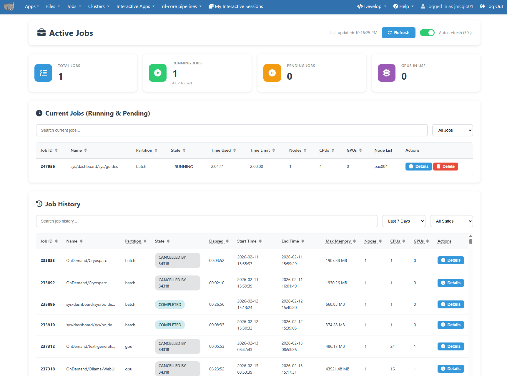
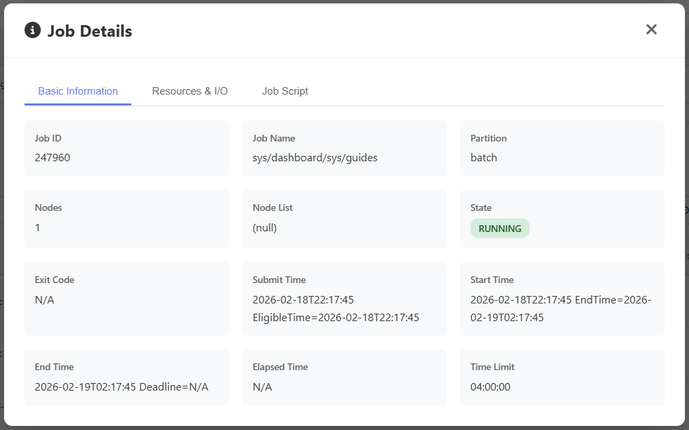
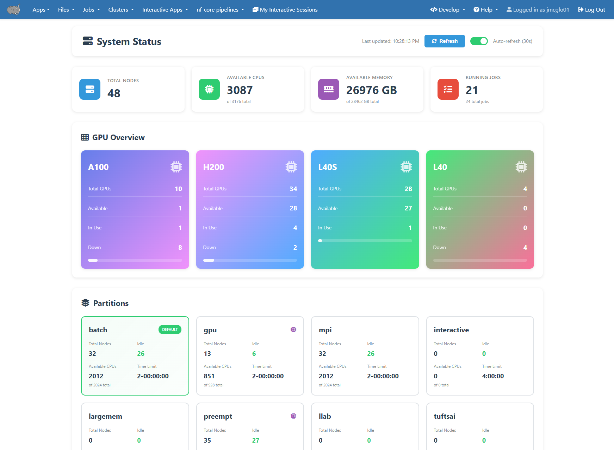

# Job Monitoring and Management

Monitoring your jobs and the resources they use is an important part of using any HPC cluster.  There are two primary ways to do that on our systems, the Open OnDemand Dashboard and Slurm command line tools.  

```{attention}
We recommend new users start with the Open OnDemand method.
```

## Open OnDemand Dashboard

The Open OnDemand server provides an ["Active Jobs" dashboard](https://ondemand-prod.pax.tufts.edu/pun/sys/dashboard/activejobs) that shows your pending and running jobs, as well as your job history.  It can be accessed at under the **Jobs** -> **Active Jobs** menu item.  



Clicking on each job will show additional details about it.  Completed jobs will include efficiency data under the **Resources and I/O** tab.



Overall cluster status and resources the available can be see on the ["System Status" dashboard](https://ondemand-prod.pax.tufts.edu/pun/sys/dashboard/system-status).  It can be accessed at under the **Clusters** -> **System Status** menu item.  



## Using the command line
Slurm provides a set of commands to control and monitor your HPC jobs.  These can be run on any HPC node including the login nodes.

### Check Active Jobs

Active jobs are the jobs in the stage of R (running), PD (pending), or CG (completing). Only active jobs can be displayed in `squeue` command output.

To check your active jobs in the queue:

`$ squeue --me` or `$ squeue -u your_utln`

```bash
[tutln01@cc1gpu001 ~]$ squeue --me
             JOBID PARTITION     NAME     USER ST       TIME  NODES NODELIST(REASON)
            296794   preempt     bash tutln01  R       5:12      1 pax00#
[tutln01@cc1gpu001 ~]$ squeue -u tutln01
             JOBID PARTITION     NAME     USER ST       TIME  NODES NODELIST(REASON)
            296794   preempt     bash tutln01  R       5:21      1 pax00#
```

If your job is in the PD (pending) state the reason column will include details of why.  Some common reasons are listed here, and a full list can be seen at https://slurm.schedmd.com/job_reason_codes.html .  If after reviewing these it is still not clear, please contact us for assistance.

These two are the most common, and means you are waiting in line for compute nodes to become available.
 - **Resources** - The resources requested by the job are not available (e.g., already used by other jobs).
 - **Priority** - One of more higher priority jobs exist for the partition associated with the job.

Other common reasons are
 - **Dependency** - This job has a dependency on another job that has not been satisfied.
 - **QOSMax*** - This means you are currently using the maximum of given resource per user or account.  For instance QOSMaxCpuPerUserLimit reffers to the CPU limit and QOSMaxGRESPerUser reffers to the GPU limit.
 - **Reservation** - The job is waiting its advanced reservation to become available.

 

To check **details** of your **active jobs** (running or pending):

`$ scontrol show jobid -dd JOBID`

```bash
[tutln01@pax00# ~]$ scontrol show jobid -dd 296794
JobId=296794 JobName=bash
   UserId=tutln01(31003) GroupId=tutln01(5343) MCS_label=N/A
   Priority=10833 Nice=0 Account=(null) QOS=normal
   JobState=RUNNING Reason=None Dependency=(null)
   Requeue=0 Restarts=0 BatchFlag=0 Reboot=0 ExitCode=0:0
   DerivedExitCode=0:0
   RunTime=00:10:33 TimeLimit=1-02:30:00 TimeMin=N/A
   SubmitTime=2021-03-22T22:18:50 EligibleTime=2021-03-22T22:18:50
   AccrueTime=2021-03-22T22:18:50
   StartTime=2021-03-22T22:18:55 EndTime=2021-03-24T00:48:55 Deadline=N/A
   PreemptEligibleTime=2021-03-22T22:18:55 PreemptTime=None
   SuspendTime=None SecsPreSuspend=0 LastSchedEval=2021-03-22T22:18:55
   Partition=preempt AllocNode:Sid=login-p01:34458
   ReqNodeList=(null) ExcNodeList=(null)
   NodeList=cc1gpu001
   BatchHost=cc1gpu001
   NumNodes=1 NumCPUs=2 NumTasks=2 CPUs/Task=1 ReqB:S:C:T=0:0:*:*
   TRES=cpu=2,mem=2G,node=1,billing=2
   Socks/Node=* NtasksPerN:B:S:C=0:0:*:* CoreSpec=*
   JOB_GRES=(null)
     Nodes=cc1gpu001 CPU_IDs=30-31 Mem=2048 GRES=
   MinCPUsNode=1 MinMemoryNode=2G MinTmpDiskNode=0
   Features=(null) DelayBoot=00:00:00
   OverSubscribe=OK Contiguous=0 Licenses=(null) Network=(null)
   Command=bash
   WorkDir=/cluster/home/tutln01
   Power=
   MailUser=tutln01 MailType=NONE
```

### Cancel Jobs

To cancel a specific job:

`$ scancel JOBID`

To cancel all of your jobs:

`$ scancel -u $USER` or `$ scancel -u your_utln`
