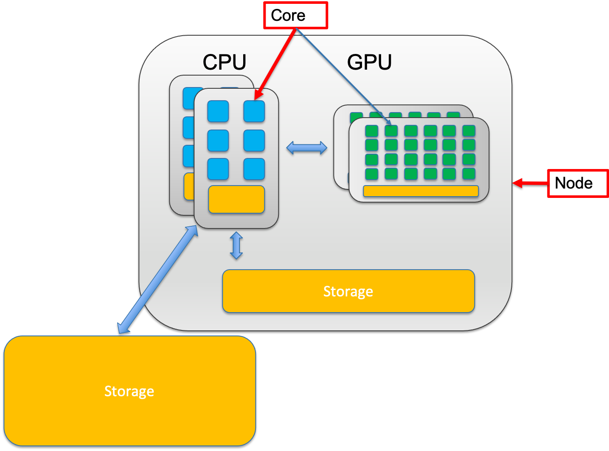

# Cores vs Node

- A **node** is a single computer in the system, which has a number of computing units, **cores**.

- Number of CPU cores must be specified when running programs on Tufts HPC cluster.

- In the case one job requires multiple CPU cores, it's recommended to specify if user desire all the required CPU cores to be allocated on a single node or multiple nodes.

- Not all programs can utilize CPU cores allocated cross nodes. Please check your program's specifics before submitting jobs.
